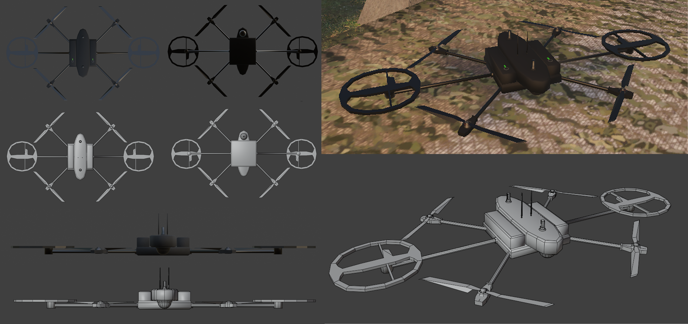
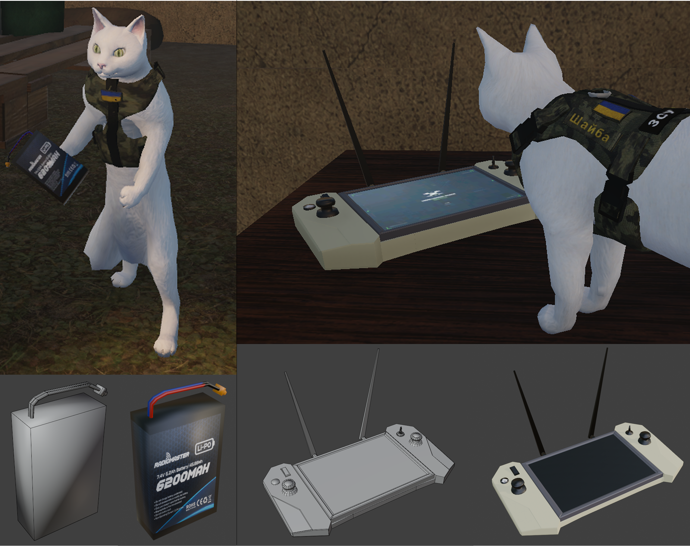
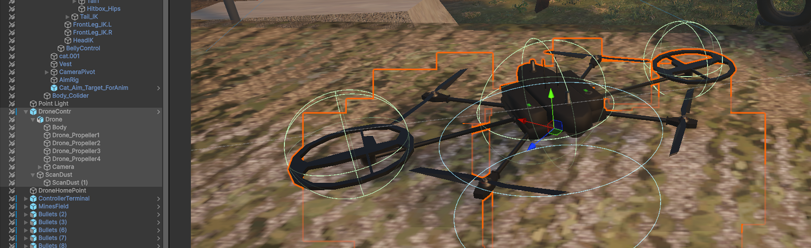

# Drone and Minefield System

<p align="center">
  
</p>

## Overview

The first level of **ZSU HUB** introduces a drone-assisted mine-detection system. The player must find a battery, install it in the controller terminal, switch from Shaiba to the **Spiner** drone, scan the field at low altitude, and use the detected mine positions to plan a safe route.

The system combines:

- original drone, battery, controller, mine, and warning-sign assets;
- inventory-gated activation;
- Unity Input System action-map switching;
- Cinemachine camera switching;
- Rigidbody-based flight;
- low-altitude scan validation;
- allocation-free mine queries;
- persistent mine highlighting;
- proximity and bullet-triggered mine detonation;
- distance-based damage and physical knockback;
- level-restart state restoration.

---

## My Contribution

I created and integrated the complete drone and minefield pipeline:

- Spiner drone 3D model, materials, scanning coils, propellers, and camera mount;
- mine model, battery, controller terminal, and mine-warning signs;
- Unity prefabs, hierarchy, colliders, Rigidbody settings, layers, and particle effects;
- drone flight, stabilization, visual tilt, propeller animation, and return-home logic;
- battery installation and inventory integration;
- Player/Drone input-map switching;
- Cinemachine priority switching between Shaiba and the drone;
- drone HUD and player HUD state switching;
- ground-proximity scan validation;
- timed area scanning with `Physics.OverlapSphereNonAlloc`;
- mine-root resolution and duplicate-detection prevention;
- red outline activation for discovered mines;
- mine warning blink, explosion VFX, damage falloff, and knockback;
- direct mine detonation through the player projectile system;
- restart handling for battery and drone state.

---

## Original Assets

### Spiner Drone

The drone was modelled as a real-time gameplay asset with four propellers, two circular scanning elements, a central body, antennas, and an integrated camera.

<p align="center">
  
</p>

### Minefield Assets

The minefield uses an original mine model together with several Ukrainian and bilingual warning signs. Mines are placed partially below the terrain so they are difficult to identify without the drone.

<p align="center">
  
</p>

### Battery and Controller Terminal

Drone access is locked behind a battery-dependent interaction. The player must collect the battery through the inventory system and install it at the controller terminal.

<p align="center">
  
</p>

---

## Activation and Control Ownership

`DroneInteraction` coordinates the transition between the character and drone systems.

### Battery Gate

The interaction terminal remains locked until a held object tagged `Battery` is detected. Installing the battery:

1. sets `_isBatteryInstalled`;
2. removes the selected battery from `InventoryManager`;
3. destroys the held battery model;
4. enables the terminal screen overlay;
5. plays the optional startup sound;
6. displays the `Battery Installed` message.

Before installation, pressing the interaction action displays `Battery required!`.

### Entering Drone Mode

`EnterDrone()` performs an atomic control-state switch:

- disables `MovementStateManager`;
- calls `DroneController.ActivateDrone(true)`;
- raises the drone Cinemachine camera priority;
- lowers the player camera priority;
- enables the drone-controls HUD;
- hides the player health bar and inventory HUD;
- switches `PlayerInput` from the `Player` action map to `Drone`.

### Exiting Drone Mode

`ExitDrone()` restores the character state:

- deactivates drone physics;
- returns the drone to its saved home transform;
- re-enables Shaiba’s movement;
- restores the player Cinemachine camera;
- restores the player health and inventory HUD;
- switches back to the `Player` action map;
- rebinds the character input actions.

Cinemachine cameras are switched through priority values rather than destroying or recreating cameras:

| Camera | Active priority | Inactive priority |
|---|---:|---:|
| Shaiba camera | 20 | 10 |
| Drone camera | 20 | 10 |

---

## Input Configuration

The drone reads actions from the active `Drone` input map.

| Default binding | Input action | Behaviour |
|---|---|---|
| `W / S` | `Move.y` | Forward and backward acceleration |
| `A / D` | `Move.x` | Yaw rotation |
| `Space` | `Lift` | Ascend |
| `Left Shift` | `Descend` | Descend |
| `Left Mouse Button` | `Scan` | Hold to scan while close to the ground |
| `Q` | `Exit` | Return control to Shaiba |

---

## Rigidbody Flight Model

`DroneController` requires a `Rigidbody` and separates frame input from physics execution:

- `Update()` handles scan state, exit input, propeller visuals, and ground checks;
- `FixedUpdate()` applies flight forces and rotation.

### Vertical Control

Each physics step applies an upward acceleration equal to gravity magnitude plus the requested vertical input:

```csharp
rb.AddForce(
    Vector3.up * (Physics.gravity.magnitude + vertical),
    ForceMode.Acceleration
);
```

This compensates for gravity at neutral input. `Lift` adds upward acceleration, while `Descend` reduces the result and drives the drone downward.

### Horizontal Motion and Rotation

Forward movement is applied along `transform.forward` using `ForceMode.Acceleration`. Horizontal input rotates the Rigidbody around the vertical axis with `MoveRotation`.

The controller also calculates an upright target rotation and interpolates toward it using `stabilizationSpeed`, preventing uncontrolled pitch and roll from accumulated physics motion.

### Visual Tilt

The physical body remains controlled by the Rigidbody. A separate `modelTransform` receives a local visual tilt based on movement input:

- forward/backward pitch;
- sideways roll;
- smoothed interpolation through `tiltSpeed`.

This preserves stable collision behaviour while giving the model visible flight feedback.

### Propellers

All assigned propeller transforms rotate every active frame using `propellerSpeed`. Propeller animation is visual and does not drive the Rigidbody forces.

<p align="center">
  
</p>

---

## Low-Altitude Scan Validation

Scanning is only enabled when two conditions are true:

```text
Scan action is held
AND
a downward raycast reaches the Ground layer
within groundCheckDistance
```

The variable is named `isTouchingGround`, but the check is a proximity raycast. The drone therefore does not need to collide with the terrain; it only needs to fly within the configured scan height.

When scanning begins:

- `scanTimer` starts accumulating;
- dust particles are enabled;
- the Rigidbody receives vertical-axis angular velocity;
- regular forward movement and yaw handling are skipped in `FixedUpdate()`.

Releasing `Scan` or moving above the allowed height resets the timer, stops the dust effect, and clears the scan rotation.

---

## Mine Detection Query

After `requiredScanTime` is reached, the controller executes:

```csharp
Physics.OverlapSphereNonAlloc(
    transform.position,
    detectionRadius,
    scanResults,
    mineLayer
);
```

### Implementation Details

- `detectionRadius` defines the scan area around the drone.
- `mineLayer` excludes unrelated scene objects.
- `scanResults` is a reusable `Collider[50]` buffer.
- `OverlapSphereNonAlloc` avoids allocating a new collider array during repeated scans.
- `discoveredMineRoots` is a `HashSet<GameObject>` that prevents repeated processing of the same mine.

### Mine Root Resolution

A detected collider may belong to a child object. `GetMineRoot()` resolves it in this order:

1. parent `Mine` component;
2. parent `Outline` component;
3. transform root as a fallback.

This ensures the highlight is applied to the complete mine prefab rather than only one collider or mesh child.

---

## Mine Highlighting

Each mine contains an initially disabled child object with `MineOutlineActivator`.

When the scan discovers a new mine:

```csharp
activator.gameObject.SetActive(true);
```

`MineOutlineActivator.OnEnable()` enables the parent `Outline` component. `OnDisable()` turns it off again.

Because the activator remains enabled after discovery, the red outline stays visible after the player exits drone mode and returns to Shaiba.

<p align="center">
  
</p>

---

## Mine Activation State

The `Mine` component prevents duplicate activation through two flags:

- `isActivating`;
- `hasExploded`.

A player trigger starts `ExplodeSequence()` only when both flags are false.

### Warning Phase

The default sequence contains:

1. configurable pre-warning delay;
2. optional activation sound;
3. timed red blinking;
4. explosion.

During blinking, the script can modify:

- mine base colour;
- HDR emission colour;
- outline colour;
- outline width;
- outline enabled state.

Original material colours, emission values, and outline settings are cached in `Awake()` and restored before the final explosion.

---

## Explosion Damage

Mine damage uses linear distance falloff.

```csharp
float t = Mathf.InverseLerp(damageRadius, 0f, distance);
float damage = Mathf.Lerp(minDamage, maxDamage, t);
```

This produces:

- `maxDamage` at the mine centre;
- `minDamage` at the edge of `damageRadius`;
- no damage outside the configured radius.

The resulting value is passed directly to `CatHealth.TakeDamage()`.

### Physical Knockback

The explosion also applies an impulse to Shaiba’s Rigidbody:

1. calculate direction from mine to player;
2. limit the vertical component;
3. calculate falloff from distance;
4. clear the current vertical velocity;
5. apply `ForceMode.Impulse`.

The force decreases toward the edge of `explosionRadius`.

<p align="center">
  
</p>

---

## Bullet-Triggered Detonation

Mines can also be destroyed from a distance.

`BulletTracer` uses `Physics.SphereCastAll`, sorts hits by distance, and checks the configured collision masks. When a hit belongs to a `Mine`, it calls:

```csharp
mine.HitByBullet(hit.point, gameObject);
```

`HitByBullet()` stops the pending warning coroutine and immediately calls `Explode()`.

This gives the player two valid strategies after scanning:

- navigate around detected mines;
- shoot visible mine components to detonate them from a safer distance.

---

## Return-Home and Restart Handling

### Drone Home Transform

The drone stores either:

- an explicit `homePoint`; or
- its current transform after the scene has settled.

When leaving drone mode, `ReturnToStart()`:

- resets scan state and particle effects;
- clears linear and angular velocity;
- disables gravity;
- temporarily disables collisions;
- switches the Rigidbody to kinematic;
- restores position and rotation;
- calls `Physics.SyncTransforms()`;
- resets the visual tilt and camera angle.

### Level Restart

`DroneInteraction` implements `ILevelResettable`.

At the saved level start it records whether the battery was installed. On restart it:

- restores the battery-installed flag;
- forces control back to Shaiba;
- restores the terminal overlay;
- disables drone controls and drone camera;
- restores player controls and HUD.

`DroneController` also clears its discovered-mine set when a new non-loading scene is loaded.

---

## Selected Code Sample

- [`DroneController.cs`](../CodeSamples/Drone/DroneController.cs) — Rigidbody flight, low-altitude scanning, allocation-free mine detection, visual feedback, and return-home behaviour.
