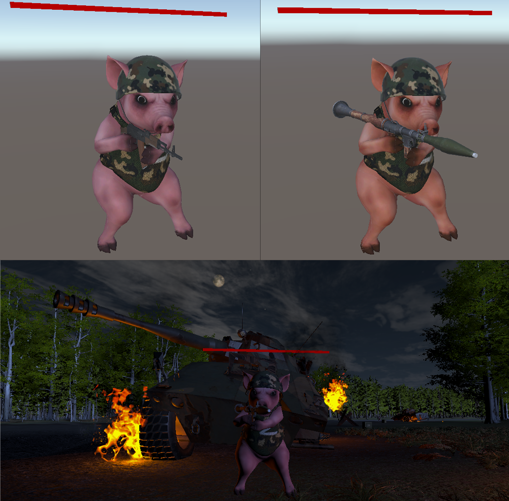
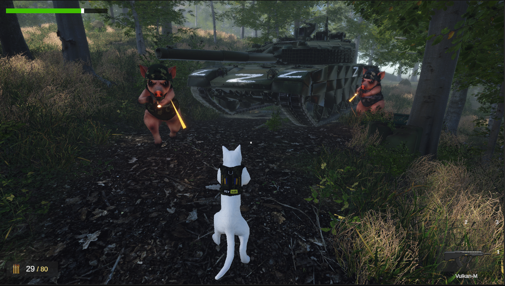
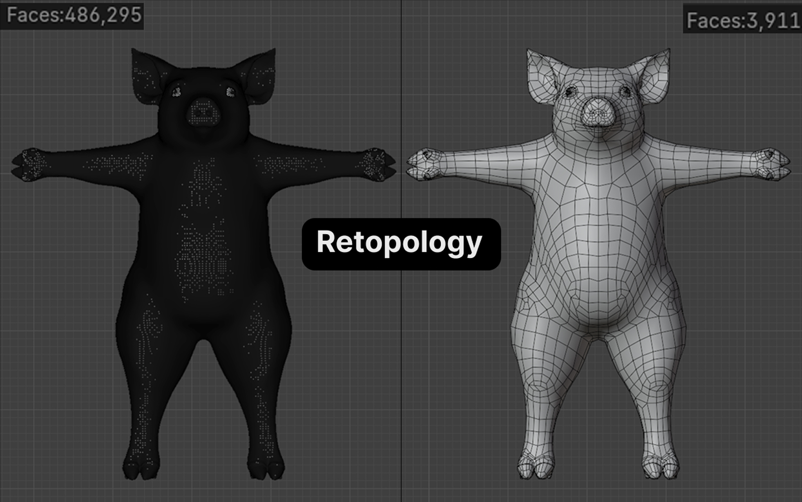
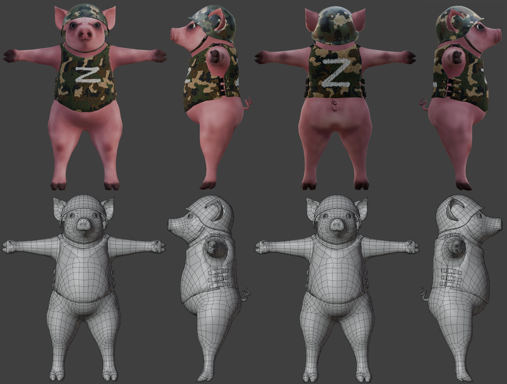
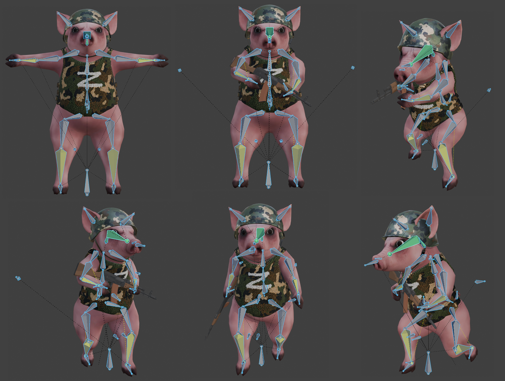
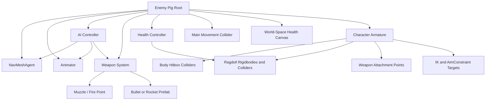
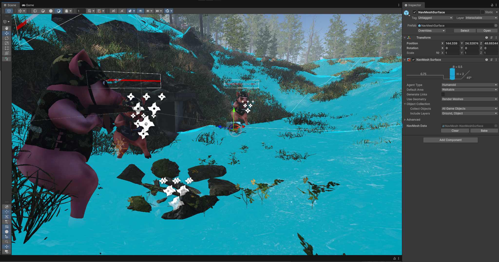
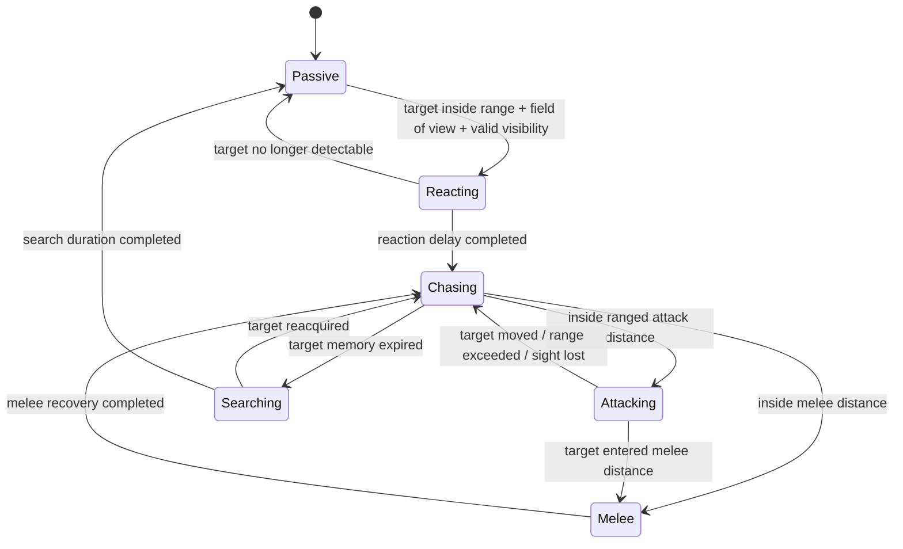
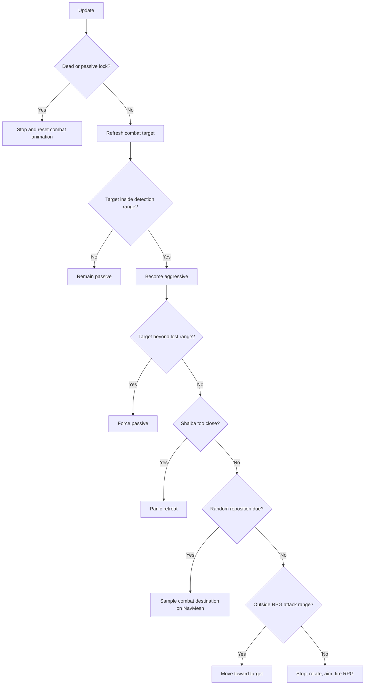
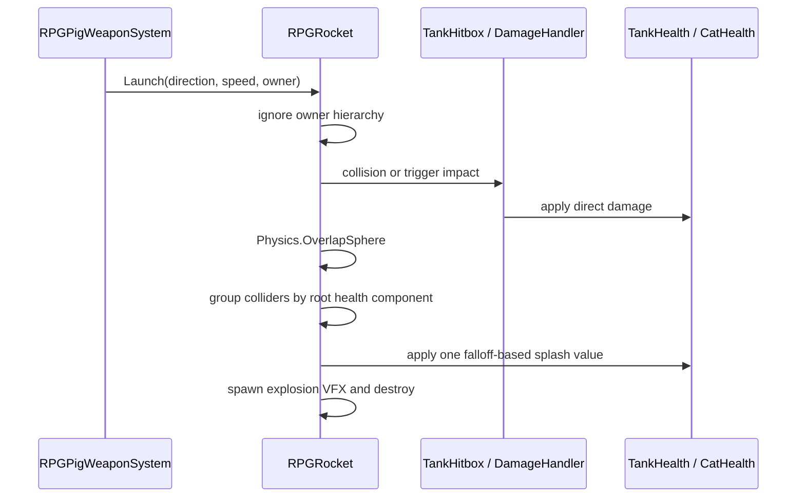

# Enemy Characters, AI and Combat System

<p align="center">
  
</p>

## Overview

The enemy system in **ZSU HUB** combines an original character-production pipeline with two gameplay-specific combat archetypes:

1. **Infantry pigs** used in the second-level forest encounters.
2. **RPG pigs** used as anti-vehicle enemies during the third-level tank mission.

Both archetypes use the same stylized visual identity, but their runtime behaviour is intentionally different. Infantry enemies are designed around perception, coordinated group aggression, ranged bursts, searching, repositioning, and close-range melee attacks. RPG enemies operate at longer distances, dynamically choose between Shaiba and the tank, launch explosive projectiles, reposition during combat, and retreat when the player approaches too closely.

The enemy feature is divided into independent components rather than implemented as one monolithic script:

- perception and behavioural state control;
- NavMesh navigation;
- group-alert propagation;
- animation and aiming;
- firearm or RPG weapon logic;
- projectile simulation;
- body hitboxes and damage multipliers;
- world-space health UI;
- ragdoll death;
- level-reset integration.

This separation allows the same character asset to support distinct tactical roles while keeping navigation, combat, damage, animation, and presentation responsibilities independently configurable.

---

## Enemy Roles Across the Game

| Archetype | Level | Primary target | Main weapon | Behavioural role |
|---|---:|---|---|---|
| Infantry Pig | Level 2 — Forest Combat | Shaiba | AK-47 | Detects the player, alerts its subgroup, chases, fires controlled bursts, searches after losing sight, and uses a close-range weapon strike |
| RPG Pig | Level 3 — Tank Mission | Shaiba or the T-90M tank | RPG-7 | Maintains anti-vehicle pressure, switches target according to the player’s current control state, launches direct-and-splash-damage rockets, repositions, and retreats from close player pressure |

<p align="center">
  
</p>

*Level 2 combat encounter: several infantry enemies defend the route toward the tank and create the transition from character exploration to direct combat.*

---

## Original Enemy Character Pipeline

The enemy pig was created as an original real-time character asset. The production workflow included:

- high-resolution sculpting and form development;
- manual retopology;
- UV preparation;
- materials and textures;
- helmet and tactical-vest equipment;
- a custom skeletal rig;
- skin weighting;
- combat and locomotion animation;
- weapon attachment points;
- Unity prefab integration;
- body hitboxes and ragdoll colliders.

### Retopology

The original high-density model contained **486,295 faces**. It was manually reduced to a gameplay mesh of **3,911 faces**, preserving the main silhouette and facial structure while producing topology suitable for skeletal deformation and real-time rendering.

<p align="center">
  
</p>

The lower-density mesh concentrates edge flow around deformation-critical regions:

- shoulders and upper arms;
- elbows and wrists;
- hips and knees;
- neck and head;
- snout and facial features;
- torso volume and vest contact areas.

This topology supports upright weapon handling without retaining the computational cost of the sculpted source mesh.

### Final Model and Equipment

<p align="center">
  
</p>

The final enemy presentation combines:

- a stylized pig character;
- a camouflage helmet;
- a camouflage tactical vest;
- weapon-specific hand attachments;
- a readable silhouette from the third-person gameplay camera.

The textured and wireframe turnarounds document both the finished visual asset and the underlying topology used by the Unity character.

---

## Rigging and Animation

The character uses a custom armature created for upright locomotion and weapon interaction. The rig supports:

- idle and movement states;
- forward pursuit;
- aiming and upper-body rotation;
- standing fire;
- kneeling fire;
- turn-in-place motion;
- melee attack;
- AK-47 handling;
- RPG-7 handling;
- reaction and death transition;
- ragdoll activation.

<p align="center">
  
</p>

### Layered Animation

Combat animation is not driven only by full-body clips. The runtime controller also blends dedicated animation layers:

- `PigShootingLayer`;
- `PigKneelLayer`.

The AI gradually changes layer weights rather than switching them instantly. This allows locomotion, aiming, firing, and kneeling to remain visually connected.

The main animator parameters used by the enemy controllers include:

```text
Speed
IsAiming
IsShooting
TurnAngle
MeleeTrigger
Shoot
```

An `AimConstraint` on the upper body is connected to a runtime target or to a stabilized proxy transform positioned near the target’s upper torso. This keeps the spine and weapon aligned with the target while avoiding unstable aiming caused by animated root or collider offsets.

---

## Unity Prefab Composition

<p align="center">
  
</p>

The enemy prefab is assembled as a hierarchy of specialized runtime components.



### Root-Level Responsibilities

The root object contains the systems that control the active living character:

- `NavMeshAgent` for pathfinding;
- `Animator` for locomotion and combat presentation;
- `PigAI` or `RPGPigAI` for decision logic;
- `PigWeaponSystem` or `RPGPigWeaponSystem` for attack execution;
- `PigHealth` or `RPGPigHealth` for damage and death;
- a primary collider used during navigation;
- a root Rigidbody where required;
- a world-space health canvas.

### Child-Level Responsibilities

The armature contains:

- bone-attached body hitboxes;
- ragdoll rigidbodies;
- ragdoll colliders;
- hand slots;
- muzzle points;
- IK and pole targets;
- head and body hitboxes;
- weapon-specific objects and effects.

Keeping movement collision separate from per-body damage hitboxes prevents the NavMesh character controller from depending on a complex animated collider hierarchy.

---

## NavMesh Navigation

<p align="center">
  
</p>

Both enemy archetypes use `NavMeshAgent` for movement across the uneven forest terrain.

The navigation setup provides:

- traversal over baked walkable surfaces;
- obstacle-aware chasing;
- sampled retreat destinations;
- sampled combat-reposition destinations;
- restoration to saved spawn positions;
- separation between pathfinding and manual combat rotation.

The AI checks that the agent is enabled and currently placed on a NavMesh before issuing movement commands. This avoids invalid `SetDestination`, `ResetPath`, or `Warp` calls during death, scene reset, and prefab initialization.

---

# Level 2 Infantry AI

## Behaviour Model

The infantry controller uses an explicit finite-state structure:

```text
Passive
Reacting
Chasing
Attacking
Searching
Melee
```



This state model creates a more readable combat loop than a single distance check. Each state owns a specific responsibility and limits which systems are active.

---

## Perception

The infantry enemy evaluates:

- distance to Shaiba;
- horizontal field of view;
- line of sight;
- target visibility memory;
- the last known target position.

Selected default values from the current controller are:

| Parameter | Default |
|---|---:|
| Detection range | `20 m` |
| Aggressive pursuit range | `35 m` |
| Field of view | `135°` |
| Perception refresh interval | `0.12 s` |
| Reaction delay | `0.25–0.75 s` |
| Target memory | `4.5 s` |
| Search duration | `2.2 s` |

Passive detection requires the player to be inside the detection distance and field of view. Line-of-sight detection can be enabled or disabled through serialized configuration.

The visibility test casts from an eye-height position toward the target’s aim position. Hits belonging to the enemy’s own hierarchy are ignored. The closest remaining obstruction determines whether the target is visible.

When visibility is lost, the enemy does not instantly return to passive behaviour. It stores the last known target position and may continue chasing or enter a temporary search state.

---

## Group Aggression

Infantry enemies are placed into independent encounter groups using `PigAlertGroup`.

Each `PigAI` registers itself with the group when enabled and unregisters when disabled. A group alert can be triggered by:

- direct visual detection;
- receiving damage.

The source enemy sends the shared target to the group. Every other valid member receives the target and immediately transitions into aggressive pursuit.

<p align="center">
  
</p>

## Reaction, Chase, and Search

When Shaiba is first detected, the enemy enters a short `Reacting` state instead of firing immediately. During this delay it:

- stops the agent;
- rotates toward the target;
- starts blending the aim constraint;
- waits for a randomized reaction interval.

After reacting, the enemy becomes aggressive and transitions to `Chasing`.

During pursuit, destinations are not reassigned every frame. The controller updates the destination only when:

- a configured time interval has elapsed; or
- the requested target position moved beyond a threshold.

This reduces unnecessary path recalculation and helps prevent visible NavMesh jitter.

When the target is no longer visible, the enemy uses the stored last-known position. If Shaiba is not reacquired before the memory and search conditions expire, the enemy returns to `Passive`.

---

## Combat Positioning

The ranged attack state uses distance hysteresis and target-motion checks.

An infantry pig can leave its firing position when:

- the target moves outside attack distance plus a resume buffer;
- visibility is lost;
- Shaiba changes position significantly;
- the enemy has remained static long enough and should move closer.

Selected defaults:

| Parameter | Default |
|---|---:|
| Ranged attack range | `12 m` |
| Melee range | `2.5 m` |
| Attack resume buffer | `0.35 m` |
| Target reposition threshold | `1.6 m` |
| Static firing duration before approach | `3.5 s` |
| Desired approach distance | `5 m` |

This prevents the enemy from becoming a stationary turret after reaching the first valid shooting position.

---

## Rotation and Aiming Stability

The infantry agent can disable automatic NavMesh rotation and rotate the character manually. Movement orientation and combat orientation are handled separately:

- while moving, the character faces the agent velocity or steering direction;
- while attacking, the character rotates toward the target;
- firing is blocked until the horizontal aim error is within the configured angle;
- an aim-settle delay prevents immediate shots during the first attack frame.

Selected defaults:

| Parameter | Default |
|---|---:|
| Combat rotation speed | `8` |
| Movement rotation speed | `16` |
| Maximum fire angle | `10°` |
| Aim settle time | `0.22 s` |
| Time before kneeling layer | `0.8 s` |

The weapon is therefore triggered only after navigation, body rotation, animation layers, and upper-body aiming have reached a valid firing state.

---

## Burst Fire System

`PigWeaponSystem` separates the request to fire from the actual projectile spawn.

The ranged weapon uses:

- randomized bursts of `2–3` shots;
- `0.3 s` between shots;
- `0.8–1.4 s` between bursts;
- a short randomized delay before the first shot;
- configurable angular inaccuracy;
- muzzle flash playback.

### LateUpdate Muzzle Synchronization

A requested shot can be queued and spawned during `LateUpdate`.

This is important because the Animator and IK system may change the hand, weapon, and muzzle transform during the same frame. Spawning after those transforms have reached their final rendered pose reduces:

- projectiles appearing beside the muzzle;
- trails starting from stale positions;
- visible mismatch between animation and firing direction.

The projectile root can also be forced back to the exact calculated muzzle position immediately after instantiation.

### Aim Point Resolution

The system can aim at the target collider’s center rather than blindly adding a large vertical offset to the root transform. A fallback torso-height offset is used only when no suitable collider is found.

---

## Infantry Projectile Simulation

The infantry projectile is represented by `EnemyBulletTracer`.

Instead of moving a transform and checking only the final position, the script performs a segmented `Physics.SphereCast` between the previous and next positions. This reduces missed collisions for fast projectiles.

Selected defaults:

| Parameter | Default |
|---|---:|
| SphereCast radius | `0.05 m` |
| Projectile speed | `80 m/s` |
| Damage | `20` |
| Lifetime | `3 s` |

The tracer:

1. receives the exact muzzle position and shot direction;
2. clears previous trail and particle history;
3. optionally remains at the muzzle for the first rendered frame;
4. SphereCasts along each movement segment;
5. distinguishes ground and player hit layers;
6. resolves `DamageHandler` from the collider or its parent;
7. applies damage and destroys itself on impact.

---

## Melee Attack

When Shaiba enters the melee radius, the enemy temporarily switches from NavMesh movement to a dedicated melee routine.

The routine:

- enters the `Melee` state;
- stops the agent;
- disables ranged animation layers;
- clears the aim constraint;
- faces Shaiba directly;
- triggers `MeleeTrigger`;
- optionally performs a short code-driven lunge;
- restores the NavMesh agent after recovery;
- returns to pursuit.

The weapon collider is enabled only during the active attack window through `StartAttack()` and `EndAttack()`.

`MeleeWeaponDamage` uses a `HashSet` of target instance IDs so that one swing cannot damage the same target repeatedly through multiple `OnTriggerEnter` or `OnTriggerStay` callbacks.

Selected defaults:

| Parameter | Default |
|---|---:|
| Melee damage | `15` |
| Knockback force | `12` |
| Melee cooldown | `1.1 s` |
| Recovery time | `0.55 s` |

---

# Level 3 RPG AI

## Tactical Role

RPG pigs are designed as long-range anti-vehicle enemies. Their primary purpose is to threaten the T-90M tank and create a mission-failure condition, while still remaining able to attack Shaiba when the player leaves the vehicle.

The RPG controller uses priority-ordered decision logic:



The highest-priority action is close-range retreat. Random combat movement is evaluated second. Standard chase or attack behaviour is processed only when neither movement override is active.

---

## Dynamic Target Selection

The RPG enemy periodically selects a combat target.

- When the player is controlling the tank, the enemy prioritizes a living `TankHealth` target.
- When the player is outside the vehicle, the enemy targets the object tagged `Player`.
- The tank is retained as a fallback when the player object is unavailable.

This allows the same enemy to participate in both vehicle combat and on-foot combat without requiring separate scene-specific target assignments.

Selected defaults:

| Parameter | Default |
|---|---:|
| Target search interval | `0.5 s` |
| Detection range | `45 m` |
| RPG attack range | `30 m` |
| Lost range | `60 m` |
| Passive lock after level start | `2 s` |

---

## Panic Retreat

RPG pigs are deliberately vulnerable at close range.

When Shaiba approaches within the configured retreat radius, the controller:

1. computes a horizontal direction away from Shaiba;
2. adds a randomized side offset;
3. generates several candidate destinations;
4. projects each candidate onto the NavMesh with `NavMesh.SamplePosition`;
5. rejects positions that do not meaningfully increase the distance from Shaiba;
6. starts navigation toward the first valid retreat point;
7. disables aiming and shooting while retreating;
8. stops the retreat after arrival, timeout, invalid path, or sufficient distance.

Selected defaults:

| Parameter | Default |
|---|---:|
| Retreat trigger range | `4 m` |
| Desired retreat distance | `8 m` |
| Side-step variation | `3 m` |
| Maximum retreat duration | `2.5 s` |
| Arrival threshold | `0.8 m` |
| Candidate attempts | `14` |
| Retreat cooldown | `0.35 s` |

By default, this panic retreat responds to Shaiba rather than to the tank. The behaviour communicates the RPG unit’s role as a ranged specialist rather than a close-combat enemy.

---

## Random Combat Repositioning

To avoid a permanently static firing line, RPG pigs periodically move to a new nearby point during combat.

The controller:

- generates random horizontal directions;
- chooses a distance inside a configurable radius;
- samples the candidate on the NavMesh;
- starts movement when a valid point is found;
- disables aim and fire layers during movement;
- stops after arrival, timeout, or path failure.

Selected defaults:

| Parameter | Default |
|---|---:|
| Reposition interval | `5–10 s` |
| Reposition radius | `7 m` |
| Minimum move distance | `2.5 m` |
| Maximum move duration | `3 s` |
| Arrival threshold | `0.8 m` |
| NavMesh sample distance | `3 m` |

Random movement is restricted to combat distances near the target. When the enemy is too far away, normal pursuit receives priority.

---

## RPG Firing

When the target is inside attack range, the RPG pig:

- stops and clears its NavMesh path;
- disables automatic agent rotation;
- rotates toward the selected target;
- activates aiming and shooting animator parameters;
- blends standing and kneeling layers;
- sends the target to `RPGPigWeaponSystem`.

`RPGPigWeaponSystem` applies:

- a configurable fire cooldown;
- a target-height or dedicated aim-point calculation;
- angular inaccuracy;
- rocket instantiation at a dedicated muzzle point;
- launch speed;
- muzzle particle effects;
- a shooting animation trigger.

Selected defaults:

| Parameter | Default |
|---|---:|
| Fire cooldown | `3 s` |
| Rocket speed | `28 m/s` |
| Angular inaccuracy | `1.2°` |

---

## Rocket Damage Pipeline

The RPG projectile supports direct impact and radial damage.



The direct-hit path resolves:

- `TankHitbox` or `TankHealth`;
- the player’s `DamageHandler` and `CatHealth`.

The splash path uses `Physics.OverlapSphere`. Because both the tank and character contain several colliders, the script builds dictionaries keyed by the root health component. Only the highest calculated splash value is retained for each target.

This prevents one explosion from damaging the same tank or character multiple times simply because several child colliders were inside the blast radius.

Splash damage decreases linearly with the distance from the explosion to the collider’s closest point:

```text
damagePercent = 1 - clamp(distance / splashRadius)
finalDamage = splashDamage × damagePercent
```

The directly hit target is excluded from the additional splash pass when appropriate, preventing accidental double application of direct and radial damage.

---

# Health, Hitboxes, and Damage Feedback

## Per-Body Hitboxes

The enemy armature contains child hitbox components connected to the root health controller.

Each hitbox can apply a serialized damage multiplier before forwarding damage:

```text
finalDamage = incomingDamage × hitboxMultiplier
```

This supports different damage values for different body regions without duplicating the health system across bones.

The hitbox component resolves its parent `PigHealth` or `RPGPigHealth`, so projectiles can strike animated child colliders while the root object remains the single source of health state.

---

## World-Space Health UI

Enemy health is displayed through a world-space canvas.

The health canvas is hidden during the initial passive state and becomes visible after damage. The UI controller receives:

- maximum health during initialization;
- current health after each hit;
- a normalized fill value for the health-bar image.

This keeps the scene visually cleaner before combat while providing immediate hit confirmation once an encounter begins.

---

## Damage-Driven Aggression

Taking damage is also a behavioural event.

For infantry enemies, damage can:

- activate the damaged enemy;
- propagate aggression through its `PigAlertGroup`.

For RPG enemies, the health controller can notify the AI through an event or direct aggression method, ensuring that a long-range hit wakes the enemy even before automatic distance aggression is triggered.

---

# Ragdoll Death System

While alive, ragdoll rigidbodies remain kinematic and body colliders are used as trigger-style hitboxes. On death, the health controller:

1. sets the dead flag;
2. hides the health UI;
3. disables AI and weapon scripts;
4. stops and disables the NavMeshAgent;
5. disables the Animator;
6. disables the main navigation collider;
7. freezes or disables the root Rigidbody;
8. enables ragdoll rigidbodies and physical colliders;
9. clears old linear and angular velocity;
10. optionally applies an impulse based on the final hit direction;
11. removes the object after a configurable delay.

For the RPG variant, the death impulse uses the stored hit direction when available and falls back to the opposite of the character’s forward direction. An upward component is added before the impulse is distributed across ragdoll bodies.

The implementation also includes versions with delayed ragdoll activation, velocity clearing over several physics frames, damping, and limited angular velocity. These safeguards reduce the common “ragdoll explosion” problem caused by overlapping animated colliders at the exact frame physics is enabled.

---

# Level Reset Integration

Both enemy controllers participate in level restart logic through `ILevelResettable`.

At initialization, each enemy stores:

- its starting position;
- its starting rotation.

When the level is reset, the controller:

- stops active movement;
- cancels combat overrides;
- clears the target;
- resets aggression;
- restores passive animation;
- resets weapon burst or RPG timing state;
- warps the NavMeshAgent back to the saved position;
- restores the original rotation;
- applies a short passive lock.

This provides deterministic restarts without requiring the entire Unity scene to reconstruct every behavioural field manually.

---

# Technical Component Summary

| Component | Responsibility |
|---|---|
| `PigAI` | Infantry finite-state behaviour, perception, field of view, line of sight, target memory, pursuit, search, ranged positioning, melee transition, animation coordination, reset |
| `PigAlertGroup` | Local encounter membership and propagation of shared aggression targets |
| `PigWeaponSystem` | Burst scheduling, target aim-point calculation, LateUpdate muzzle synchronization, projectile spawning, muzzle flash, melee-window forwarding |
| `EnemyBulletTracer` | Fast segmented bullet movement, SphereCast collision, layer filtering, player damage, trail reset |
| `MeleeWeaponDamage` | Animation-window melee damage, per-swing duplicate prevention, knockback |
| `PigHealth` | Infantry health, UI updates, damage-triggered aggression, death transition, ragdoll |
| `PigHitbox` | Body-region damage forwarding and damage multiplier |
| `RPGPigAI` | Player/tank target selection, long-range chase and attack, panic retreat, random combat repositioning, animation coordination, reset |
| `RPGPigWeaponSystem` | RPG cooldown, aim direction, inaccuracy, rocket launch, muzzle effects, shoot trigger |
| `RPGRocket` | Owner exclusion, direct tank/player damage, falloff splash damage, multi-collider deduplication, explosion effects |
| `RPGPigHealth` | RPG enemy health, damage event, world-space UI, component shutdown, hit-direction ragdoll impulse |
| `RPGPigHitbox` | RPG body-region damage forwarding |

---

# Selected Serialized Defaults

These values are the selected defaults visible in the current scripts. They remain editable per prefab in the Unity Inspector.

| System | Parameter | Default |
|---|---|---:|
| Infantry perception | Detection range | `20 m` |
| Infantry perception | Field of view | `135°` |
| Infantry perception | Target memory | `4.5 s` |
| Infantry combat | Ranged attack range | `12 m` |
| Infantry combat | Melee range | `2.5 m` |
| Infantry weapon | Shots per burst | `2–3` |
| Infantry bullet | Speed | `80 m/s` |
| Infantry bullet | Damage | `20` |
| Infantry melee | Damage | `15` |
| Infantry melee | Knockback | `12` |
| RPG AI | Detection range | `45 m` |
| RPG AI | Attack range | `30 m` |
| RPG AI | Lost range | `60 m` |
| RPG AI | Retreat trigger | `4 m` |
| RPG AI | Retreat distance | `8 m` |
| RPG AI | Random reposition interval | `5–10 s` |
| RPG weapon | Fire cooldown | `3 s` |
| RPG weapon | Rocket speed | `28 m/s` |
| RPG health | Example maximum health | `120` |

---

# Public Code Sample

The public repository includes the complete selected RPG navigation and combat controller:

[`RPGPigAI.cs`](../CodeSamples/EnemyAI/RPGPigAI.cs)

The complete Unity project contains additional connected scripts for infantry AI, group alerting, projectiles, melee attacks, health, hitboxes, ragdoll behaviour, RPG launching, and explosive damage. They are described here as part of the technical portfolio breakdown, while the full project and third-party assets remain private.

---

## Enemy System Summary

The enemy implementation connects the complete character pipeline with modular gameplay engineering:

- an original optimized character model;
- custom rigging and combat animation;
- Unity prefab composition;
- NavMesh navigation;
- perception and state transitions;
- group-based alert propagation;
- ranged bursts and melee attacks;
- dynamic vehicle/player target selection;
- tactical retreat and combat repositioning;
- direct and radial projectile damage;
- body hitboxes and damage multipliers;
- world-space health feedback;
- ragdoll death;
- deterministic level reset.

The two enemy archetypes are therefore not simple visual variations. They create different combat problems for the player: infantry pigs pressure Shaiba through coordinated short- and medium-range encounters, while RPG pigs change the third level into an anti-vehicle survival scenario built around target switching, explosive damage, spacing, and tank durability.

