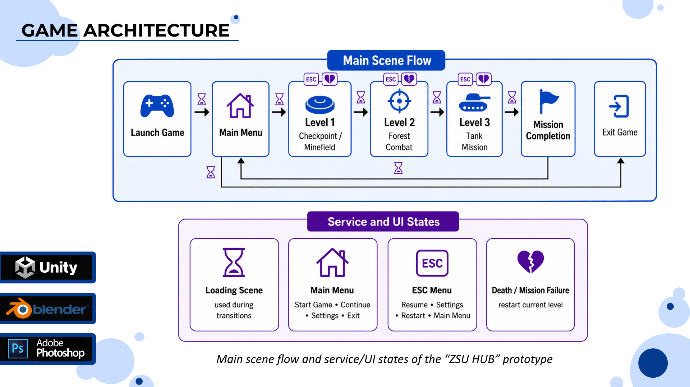
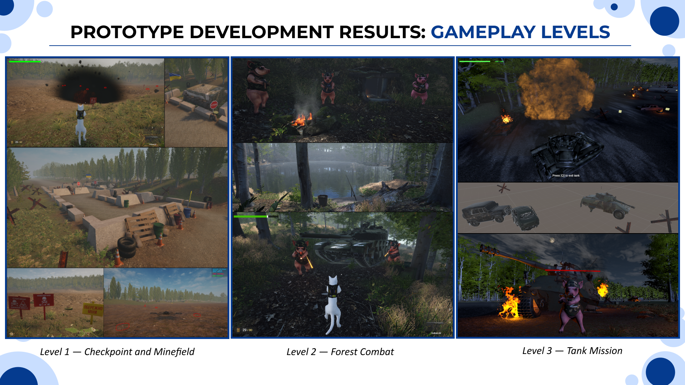
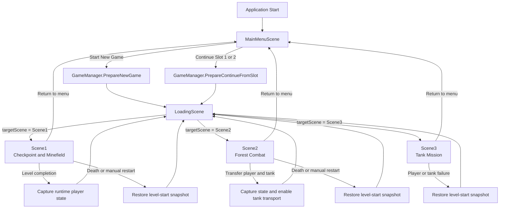
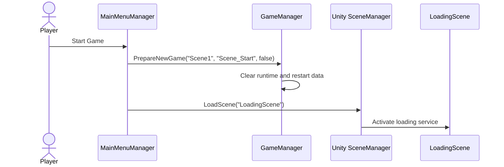
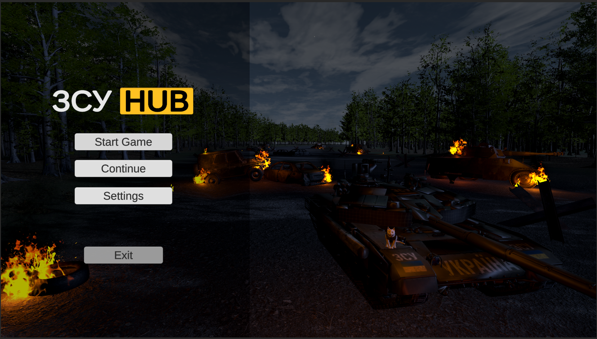
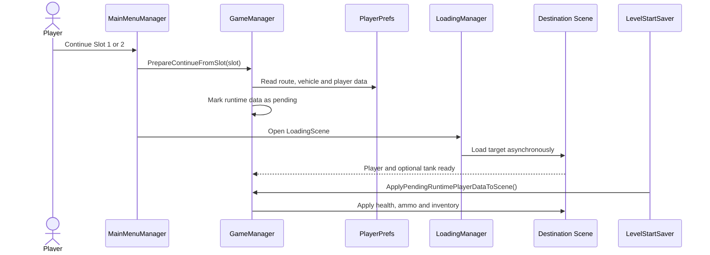
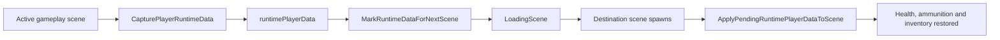
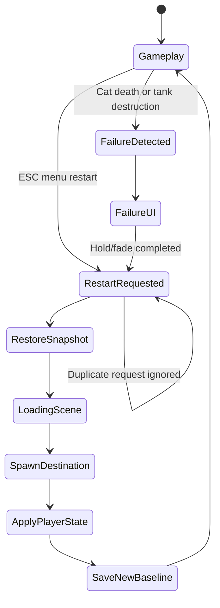
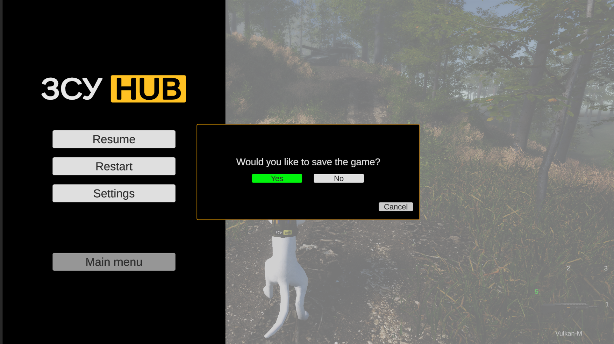
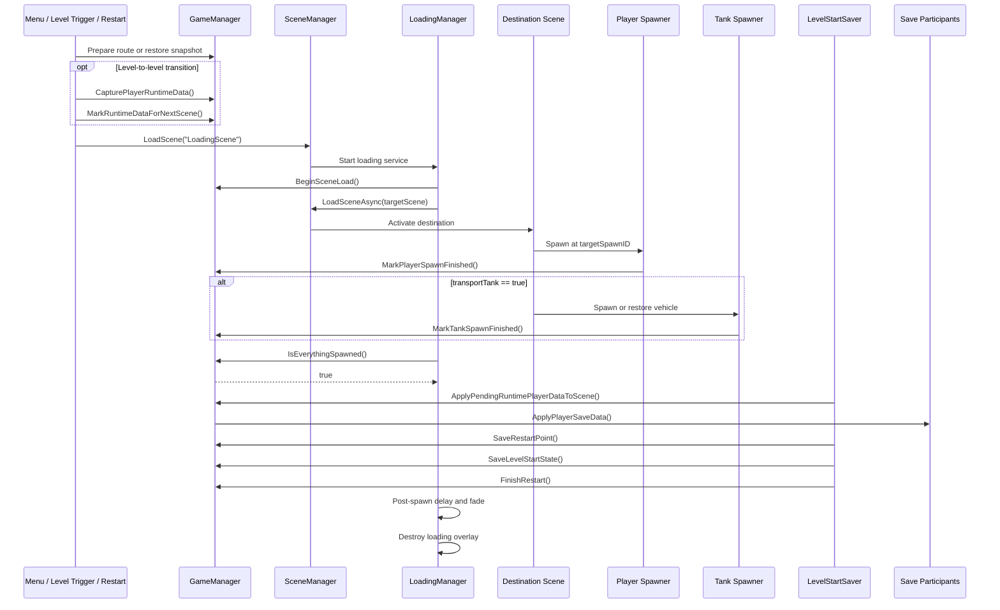

# Scene Management, State Transfer and Level Restart



## Overview

The scene-management system connects the main menu, the shared loading scene, and the three gameplay levels into one continuous progression. Its responsibility is broader than calling `SceneManager.LoadScene()`: it preserves transition intent, synchronises asynchronous loading with object spawning, transfers player state between levels, restores saved sessions, and provides deterministic level restart after character or vehicle failure.

The implementation is centred around a persistent `GameManager`, supported by scene-local loading, spawning, menu, save, and restart components.

```text
MainMenuScene
    ↓
LoadingScene
    ↓
Scene1 — Checkpoint and Minefield
    ↓
LoadingScene
    ↓
Scene2 — Forest Combat
    ↓
LoadingScene
    ↓
Scene3 — Tank Mission
```

The same `LoadingScene` is reused for a new game, level-to-level progression, loading a save slot, and restarting the current level. This keeps transition behaviour consistent and prevents individual gameplay scenes from implementing separate loading logic.

---

## Design Goals

The architecture was designed around six requirements:

1. **Centralised routing** — scene targets, spawn identifiers, and vehicle-transfer flags are stored in one persistent coordinator.
2. **Controlled presentation** — gameplay is not exposed until the destination scene and its required runtime objects are ready.
3. **State continuity** — health, ammunition, selected inventory slot, and collected items can survive scene changes.
4. **Deterministic restart** — death restores the saved level-start state instead of recreating unrelated prefab defaults.
5. **Save-slot restoration** — the main menu can continue from either of two local save slots.
6. **Subsystem decoupling** — health and inventory systems participate through interfaces rather than being hard-coded directly into the scene manager.

These requirements separate **where the game is going**, **what state must travel**, and **when the destination is safe to reveal**.

---

## Scene Catalogue

| Scene or state | Type | Technical responsibility |
|---|---|---|
| `MainMenuScene` | Entry scene | Starts a new run, inspects save-slot availability, restores a selected slot, opens settings, and confirms application exit. |
| `LoadingScene` | Reusable service scene | Loads the requested destination asynchronously, keeps a blocking overlay above the target scene, waits for the player/tank spawn handshake, then fades out. |
| `Scene1` | Gameplay scene | Introduces checkpoint exploration, inventory, the Spiner drone, and minefield scanning. |
| `Scene2` | Gameplay scene | Introduces direct combat, enemy groups, ammunition management, and access to the tank. |
| `Scene3` | Gameplay scene | Transfers the player and tank into the final night mission with RPG enemies, vehicle damage, and repair objects. |
| ESC menu | In-scene service state | Pauses gameplay, resumes, restarts the current level, or returns to the main menu with optional saving. |
| `You Died` | Failure state | Handles character death before restoring the current level-start snapshot. |
| `Mission Failed` | Failure state | Handles tank destruction and routes the player through the same restart pipeline. |



---

## High-Level Scene Flow



Gameplay scenes do not load one another as isolated destinations. They prepare a transition request in persistent state and route through `LoadingScene`.

---

## Four State Scopes

The implementation uses four state scopes with different lifetimes.

| Scope | Lifetime | Main data |
|---|---|---|
| **Transition request** | Until the next scene is loaded | `targetScene`, `targetSpawnID`, `transportTank`, `playerIsInTank` |
| **Runtime transfer state** | Between adjacent gameplay scenes | Cat health, current and reserve ammunition, selected inventory slot, slot contents and quantities |
| **Level-start snapshot** | Until the active level is completed or replaced | Scene, spawn point, vehicle mode, player state, and resettable subsystem state |
| **Save-slot state** | Across application sessions | Scene, spawn point, vehicle flags, and serialised player data stored under slot-specific keys |

Keeping these scopes separate avoids treating every transition as a permanent save and avoids using disk persistence for temporary level-to-level data.

---

## Persistent Game Coordinator

`GameManager` is the central state owner. It uses one persistent instance so that routing information is not destroyed when Unity replaces the active scene.

```csharp
private void Awake()
{
    if (Instance == null)
    {
        Instance = this;
        DontDestroyOnLoad(gameObject);
    }
    else
    {
        Destroy(gameObject);
    }
}
```

The duplicate-instance guard prevents multiple global coordinators from surviving at the same time.

### Core transition fields

```csharp
public string targetScene;
public string loadingSceneName = "LoadingScene";
public string targetSpawnID;

public bool transportTank;
public bool playerIsInTank;

public bool playerSpawnFinished;
public bool tankSpawnFinished;
```

These values form the transition contract:

- `targetScene` identifies the destination gameplay scene;
- `targetSpawnID` selects a named spawn location inside that scene;
- `transportTank` indicates that a tank must also be instantiated or restored;
- `playerIsInTank` determines whether the destination begins in vehicle mode;
- the two spawn flags prevent the loading overlay from disappearing prematurely.

The public architecture sample is available in [`GameManager.cs`](../CodeSamples/Architecture/GameManager.cs).

---

## New-Game Initialisation

A new run must not inherit health, inventory, save-slot ownership, or restart state from an earlier session.

`PrepareNewGame()` resets transient data before routing to the first level:

```csharp
public void PrepareNewGame(
    string sceneName,
    string spawnID,
    bool withTank)
{
    Time.timeScale = 1f;

    activeSaveSlot = -1;
    applyRuntimeDataOnNextScene = false;

    runtimePlayerData.Clear();
    levelStartPlayerData.Clear();

    targetScene = sceneName;
    targetSpawnID = spawnID;

    transportTank = withTank;
    playerIsInTank = withTank;

    playerSpawnFinished = false;
    tankSpawnFinished = withTank ? false : true;
    restartingLevel = false;
}
```

The main menu then loads `LoadingScene`, not `Scene1` directly.





---

## Continue-from-Slot Flow

The main menu exposes two save slots. An unavailable slot is displayed as empty and cannot be selected.

When the player chooses a valid slot, `PrepareContinueFromSlot()` restores:

- destination scene;
- destination spawn ID;
- tank-transfer state;
- whether the player was inside the tank;
- saved cat health;
- magazine ammunition;
- reserve ammunition;
- selected inventory slot;
- item identifiers and quantities for inventory slots 2 and 3.

The restored player payload is placed into `runtimePlayerData` and marked for application after the destination scene has created its local components.

```csharp
LoadPlayerDataFromSlot(slot, runtimePlayerData);
applyRuntimeDataOnNextScene = runtimePlayerData.hasData;

playerSpawnFinished = false;
tankSpawnFinished = transportTank ? false : true;
```

The continue flow therefore restores data in two stages:

1. `GameManager` reads the save slot before the transition.
2. Scene-local save participants receive the data after spawning.



`PlayerPrefs` is used as a lightweight local store appropriate for the prototype. It is not treated as encrypted, tamper-resistant, or cloud-synchronised persistence.

---

## Save-Slot Key Schema

```text
SaveSlot_{slot}_Scene
SaveSlot_{slot}_SpawnID
SaveSlot_{slot}_WithTank
SaveSlot_{slot}_PlayerInTank

SaveSlot_{slot}_Player_HasData
SaveSlot_{slot}_Player_CatHealth
SaveSlot_{slot}_Player_CurrentAmmo
SaveSlot_{slot}_Player_ReservedAmmo
SaveSlot_{slot}_Player_SelectedSlot

SaveSlot_{slot}_Player_Slot2Full
SaveSlot_{slot}_Player_Slot2ItemID
SaveSlot_{slot}_Player_Slot2Count

SaveSlot_{slot}_Player_Slot3Full
SaveSlot_{slot}_Player_Slot3ItemID
SaveSlot_{slot}_Player_Slot3Count
```

The slot prefix isolates the two save records while keeping the implementation inspectable in the Unity Editor and during debugging.

---

## LoadingScene as a Synchronisation Barrier

`LoadingScene` is not only a visual transition. It coordinates three independent events:

1. Unity finishes loading the destination scene.
2. The destination scene finishes spawning required runtime objects.
3. The loading overlay completes its presentation delay and fade.

The loading manager uses `LoadSceneAsync()`:

```csharp
AsyncOperation operation =
    SceneManager.LoadSceneAsync(GameManager.Instance.targetScene);

while (!operation.isDone)
{
    ForceCanvasOnTop();
    yield return null;
}
```

Finishing Unity's asynchronous operation does **not** automatically mean that the player, transported tank, UI, or restored state are ready. The manager therefore waits for a second condition:

```csharp
while (!GameManager.Instance.IsEverythingSpawned())
{
    ForceCanvasOnTop();
    yield return null;
}
```

Only after this barrier is satisfied does the overlay remain visible for the configured post-spawn delay and begin fading out.

### Loading defaults

| Parameter | Default | Purpose |
|---|---:|---|
| `delayAfterSpawn` | `2.0 s` | Prevents the destination from appearing during final setup frames. |
| `fadeOutTime` | `0.35 s` | Smoothly reveals the gameplay scene. |
| `loadingSortingOrder` | `32000` | Keeps the loading canvas above gameplay and service UI. |
| Restart-cover object | `__RestartBlackCover` | Allows the loading manager to remove the temporary black restart overlay after the target is ready. |

The loading object calls `DontDestroyOnLoad()` so that its canvas survives while the destination replaces `LoadingScene`. A static `activeInstance` guard prevents duplicate loading managers from overlapping.

The canvas is configured as `ScreenSpaceOverlay`, blocks raycasts, and remains interactable during the transition. This prevents accidental input from reaching a partially initialised scene.

Presentation timing uses `Time.unscaledDeltaTime`, so loading and fading remain functional even when the previous service state paused gameplay with `Time.timeScale = 0`.

---

## Player and Tank Spawn Handshake

The destination scene reports readiness through two explicit signals.

```csharp
public void BeginSceneLoad()
{
    playerSpawnFinished = false;
    tankSpawnFinished = transportTank ? false : true;
}

public void MarkPlayerSpawnFinished()
{
    playerSpawnFinished = true;
}

public void MarkTankSpawnFinished()
{
    tankSpawnFinished = true;
}

public bool IsEverythingSpawned()
{
    return playerSpawnFinished && tankSpawnFinished;
}
```

The conditional initial value of `tankSpawnFinished` is significant:

- when no tank is expected, it begins as `true`, so only the player must report readiness;
- when `transportTank` is enabled, it begins as `false`, and the loading barrier waits for both objects.

The same pipeline therefore supports character-only scenes and vehicle-transfer scenes without separate loading managers.

Concrete scene-local spawners belong to the full Unity project. The public `GameManager` sample exposes the handshake contract completed by those spawners.

---

## Runtime Player-State Transfer

Scene objects are recreated when Unity loads a new gameplay scene. To prevent Shaiba from returning to prefab defaults after every transition, the game captures transferable state before leaving and reapplies it after spawning.

### Transfer payload

```csharp
[System.Serializable]
public class PlayerSaveData
{
    public bool hasData;
    public float catHealth;

    public int currentAmmo;
    public int reservedAmmo;
    public int selectedSlot;

    public bool slot2Full;
    public string slot2ItemID;
    public int slot2Count;

    public bool slot3Full;
    public string slot3ItemID;
    public int slot3Count;
}
```

### Interface-driven participation

```csharp
public interface IPlayerSaveParticipant
{
    void CapturePlayerSaveData(PlayerSaveData data);
    void ApplyPlayerSaveData(PlayerSaveData data);
    void ResetForNewGame();
}
```

The manager discovers active and inactive participants:

```csharp
foreach (MonoBehaviour behaviour in behaviours)
{
    if (behaviour is IPlayerSaveParticipant participant)
        participant.CapturePlayerSaveData(runtimePlayerData);
}
```

The same contract is used in reverse after the destination scene is ready. The scene manager therefore does not need direct dependencies on concrete health, weapon, or inventory classes.



More character-specific persistence details are documented in [Shaiba](Shaiba.md).

---

## Level-Start Initialisation

Each gameplay scene uses `LevelStartSaver` to finalise its runtime state.

```text
Wait for player/tank spawn barrier
        ↓
Wait a short unscaled setup delay
        ↓
Lock and hide gameplay cursor
        ↓
Reset enemies to a temporary passive state
        ↓
Apply pending runtime or save-slot data
        ↓
Restore character gameplay UI
        ↓
Save scene and spawn restart point
        ↓
Capture the level-start snapshot
        ↓
Clear the restart re-entry lock
```

The default setup delay is `0.25 s`, and enemies can be forced passive for `2 s`. This protects the player from immediate AI attacks while the scene restores state and UI.

A critical ordering decision is that pending runtime data is applied **before** the level-start snapshot is captured. Therefore:

- continuing from a save restores the saved health and inventory first;
- the restored values then become the restart baseline;
- dying after continue does not revert the player to unrelated prefab defaults.

```csharp
GameManager.Instance.ApplyPendingRuntimePlayerDataToScene();

GameManager.Instance.SaveRestartPoint(
    currentSceneName,
    restartSpawnID,
    restartWithTank
);

GameManager.Instance.SaveLevelStartState();
GameManager.Instance.FinishRestart();
```

---

## Deterministic Level Restart

Restart uses a dedicated level-start snapshot, not a blind reload.

The snapshot contains:

- active level name;
- restart spawn ID;
- whether the tank belongs in the scene;
- whether the player begins inside the tank;
- a copy of the player-transfer payload;
- state supplied by objects implementing `ILevelResettable`.

```csharp
public interface ILevelResettable
{
    void SaveLevelStartState();
    void RestoreLevelStartState();
}
```

When a restart begins, `GameManager` restores the snapshot into the next transition request:

```csharp
targetScene = levelStartScene;
targetSpawnID = levelStartSpawnID;

transportTank = levelStartTransportTank;
playerIsInTank = levelStartPlayerIsInTank;

runtimePlayerData.CopyFrom(levelStartPlayerData);
applyRuntimeDataOnNextScene = runtimePlayerData.hasData;

RestoreLevelStartStateOnPersistentObjects();
SceneManager.LoadScene(loadingSceneName);
```

The `restartingLevel` flag rejects duplicate restart requests while a transition is already active.



---

## Death and Mission-Failure Routing

`LevelRestartOnDeath` monitors character and tank health events. It waits until the scene spawn barrier is complete before establishing active subscriptions.

When failure occurs, the component:

1. rejects the request if a restart is already active;
2. shows the appropriate failure UI;
3. unlocks and displays the cursor;
4. waits using real time;
5. creates or fades a black transition cover;
6. restores `Time.timeScale` to `1`;
7. calls `GameManager.RestartFromSavedLevelPoint()`.

The default failure-screen hold is `4 s`. Real-time waiting is used so restart timing is not blocked by paused gameplay.

If the central manager is unexpectedly unavailable, the component has a fallback that reloads the current scene by build index. The normal route remains the snapshot-based loading pipeline.

The visual details of `You Died`, `Mission Failed`, pause panels, and save confirmation are documented in [UI and Game States](UI-and-Game-States.md).



---

## Tank Transport Between Levels

The transition from forest combat to the tank mission requires more than selecting `Scene3`. The manager must communicate that a vehicle is expected in the destination.

| Flag | Meaning |
|---|---|
| `transportTank` | A tank must be created or restored in the destination scene. |
| `playerIsInTank` | The player begins the destination in vehicle-control mode. |

This separation supports cases where the tank is present but the player is outside it.

When transport is enabled, `tankSpawnFinished` begins as `false`. The loading overlay remains active until scene-local tank setup reports completion through `MarkTankSpawnFinished()`.

Save slots preserve both vehicle flags, so continuing directly into the tank mission reproduces the correct control mode.

Vehicle health, repair, weapons, and repaint persistence are covered in [Tank and Vehicle System](Tank-System.md).

---

## ESC Menu and Return-to-Menu Transitions

The ESC menu is an in-scene state rather than a separate Unity scene. It controls these paths:

- resume the active level;
- restart from the level-start snapshot;
- return to the main menu without saving;
- save to slot 1 or slot 2, then return to the main menu.

Before returning to the menu, the transition routine:

- sets `Time.timeScale` back to `1`;
- prevents duplicate button actions;
- hides service panels;
- applies a black fade;
- clears obsolete scene, spawn, and tank-transition flags;
- restores the system cursor;
- loads `MainMenuScene`.

Saving from the pause menu calls `GameManager.SaveGameToSlot()` before the menu transition. This captures current player state and writes scene/spawn metadata under the selected slot prefix.

---

## Transition Safety Mechanisms

### Duplicate persistent objects

`GameManager` and `LoadingManager` reject duplicate instances, preventing overlapping global state or loading overlays.

### Empty destination validation

`LoadingManager` stops and reports an error when `GameManager` is missing or `targetScene` is empty.

### Spawn-before-reveal barrier

The target is not revealed merely because `AsyncOperation.isDone` is true. The required player and optional tank must signal readiness.

### Input isolation

The loading canvas blocks raycasts and uses a high sorting order, preventing input from reaching unfinished gameplay UI.

### Time-scale normalisation

Menu, loading, restart, and level-start components restore `Time.timeScale = 1f` before scene operations. Unscaled timing is used for fades and service delays.

### Restart re-entry protection

`restartingLevel` and component-local restart flags prevent multiple death events or button presses from starting concurrent reloads.

### Safe UI restoration

After restart or continue, `LevelStartSaver` can reactivate the cat HUD and inventory hierarchy. It skips this restoration when the player intentionally starts inside the tank.

### Enemy activation delay

Scene-start AI can be forced into a short passive period so enemies do not attack during state restoration.

---

## Component Responsibilities

| Component | Lifetime | Responsibility |
|---|---|---|
| `GameManager` | Persistent | Owns transition targets, spawn flags, runtime player state, save slots, level-start snapshots, and restart coordination. |
| `MainMenuManager` | `MainMenuScene` | Starts a new run, validates save slots, and requests continue transitions. |
| `LoadingManager` | Loading transition | Loads the target asynchronously, maintains the overlay, waits for spawn completion, and fades out. |
| Scene-local spawners | Destination scene | Resolve the requested spawn context, create required player/vehicle objects, and report readiness. |
| `LevelStartSaver` | Gameplay scene | Applies pending state, normalises cursor/UI/AI, captures the restart baseline, and completes restart initialisation. |
| `IPlayerSaveParticipant` implementations | Gameplay subsystems | Capture and apply transferable health, ammunition, and inventory data. |
| `ILevelResettable` implementations | Resettable subsystems | Capture and restore level-start state for persistent or stateful objects. |
| `LevelRestartOnDeath` | Gameplay scene | Observes player/tank failure and starts the protected restart pipeline. |
| `EscapeMenuManager` | Gameplay scene | Controls pause, manual restart, saving, and return-to-menu transitions. |

---

## End-to-End Transition Sequence



This makes the loading overlay the visible boundary around a multi-step initialisation process rather than a decorative screen between direct scene loads.

---

## Functional Verification

| Test | Expected behaviour |
|---|---|
| Start a new game | Main menu prepares clean state, `LoadingScene` appears, and Shaiba spawns at the first-level start point. |
| Continue slot 1 or 2 | The selected scene and spawn point load, then saved health, ammunition, and inventory state are applied. |
| `Scene1 → Scene2` | Player state is captured before leaving and restored after the forest scene is ready. |
| `Scene2 → Scene3` | Character state is preserved, tank transport is enabled, and the barrier waits for player and vehicle setup. |
| Character death | Failure UI appears, the level-start snapshot is restored, and the level reloads through `LoadingScene`. |
| Tank destruction | Mission failure follows the protected restart pipeline and restores the vehicle-level baseline. |
| Manual restart | The ESC menu uses the same snapshot-based route as failure restart. |
| Save and return to menu | Current route and player data are written to the selected slot before the main menu loads. |
| Return without saving | The menu loads after transition state is normalised, without overwriting a slot. |
| Paused transition | Loading, delays, and fades still operate because service timing is unscaled. |

The project testing covered the main menu, loading scene, all three gameplay scenes, required spawn locations, and service-state restart behaviour.

---

## Design Trade-Offs and Production Extensions

The current architecture is appropriate for a compact portfolio prototype: it is inspectable, modular, and supports the implemented gameplay routes without introducing a large framework.

For a larger production project, useful extensions would include:

- replacing free-form scene-name strings with typed identifiers or a `ScriptableObject` route table;
- adding timeout and diagnostics to the spawn barrier so a missing readiness signal cannot wait indefinitely;
- replacing scene-wide `FindObjectsByType<MonoBehaviour>()` discovery with explicit participant registration;
- versioning save data and migrating from individual `PlayerPrefs` fields to a validated JSON or binary model;
- separating save serialisation from the global coordinator into a dedicated save service;
- adding cancellation and failure recovery around asynchronous loading;
- using additive scene loading or Addressables for larger environments;
- adding Unity PlayMode tests for new game, continue, level transition, tank transport, death restart, and corrupted save data;
- exposing transition progress when scene size makes progress feedback meaningful.

These are production-oriented extensions rather than implemented claims about the current prototype.

---

## Scene-Management Summary

The scene-management layer turns five Unity scenes and several UI states into one coherent game loop.

Its main technical decisions are:

- a persistent `GameManager` owns routing and transferable state;
- every major transition passes through one reusable `LoadingScene`;
- asynchronous loading is followed by an explicit player/tank spawn barrier;
- runtime player data is transferred through interface-based participants;
- save slots and temporary transition state are kept as separate persistence scopes;
- level restart restores a captured baseline rather than uncontrolled prefab defaults;
- failure, pause, continue, and tank-transfer paths reuse the same transition contract.

This architecture allows **ZSU HUB** to progress from exploration to combat and vehicle gameplay while preserving continuity across independently constructed Unity scenes.

