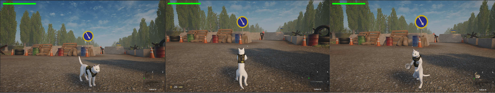
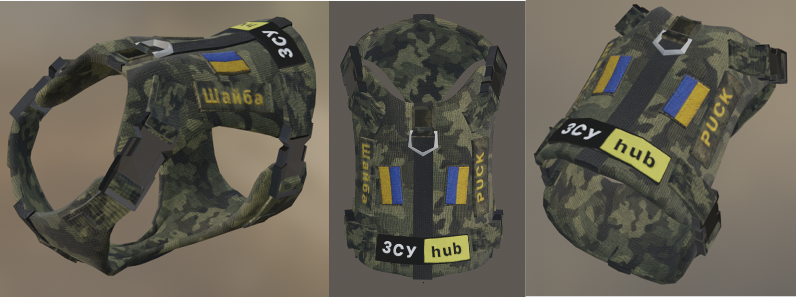
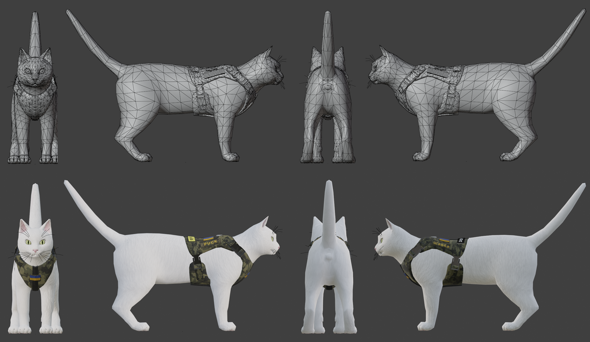
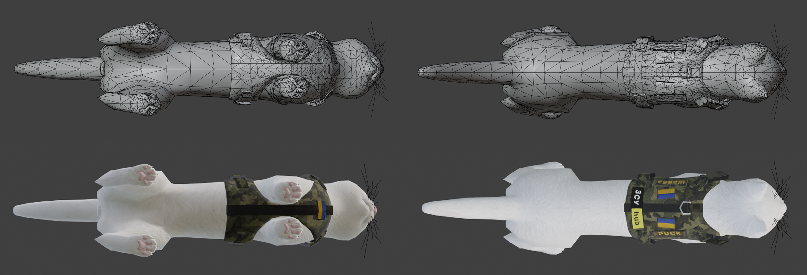
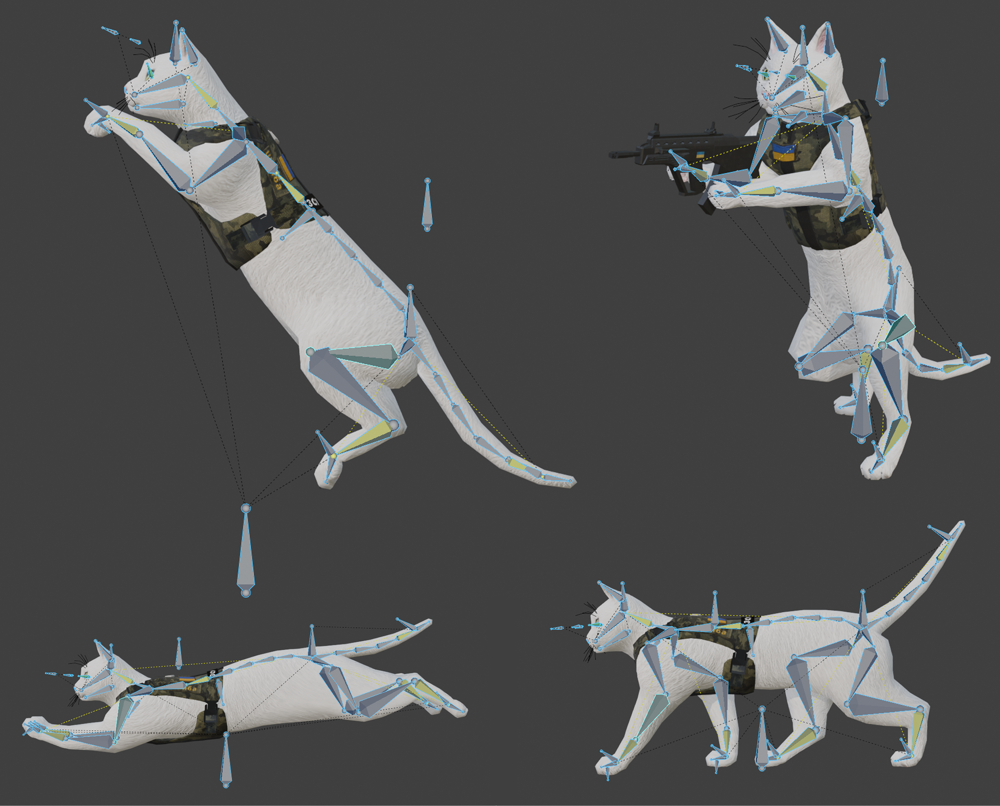
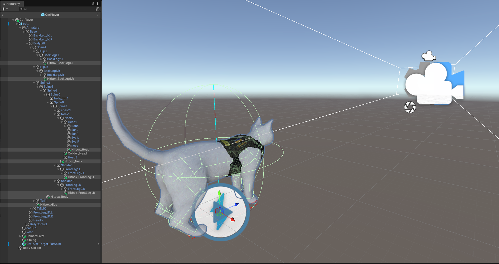
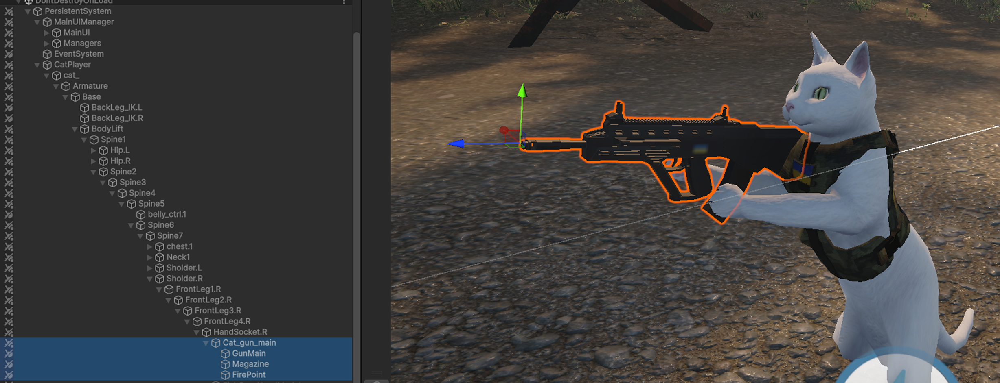
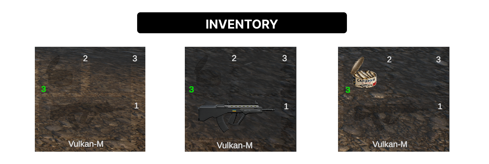

# Main Character — Shaiba

  

## Overview

**Shaiba** is the playable protagonist of **ZSU HUB** and the central link between the prototype’s exploration, inventory, combat, drone, and vehicle mechanics.

The character was designed as an original stylized interpretation inspired by the real Ukrainian cat Shaiba, who accompanied his owner, Ukrainian soldier Oleksandr Liashuk. The in-game version has a white coat and a custom tactical vest with Ukrainian flags and the project’s **Shaiba**, **Puck**, and **ZSU HUB** insignia.

Shaiba is more than a visual mascot. The character was built as a complete gameplay system combining:

- a custom 3D model and tactical equipment;
- camera-relative third-person movement;
- quadrupedal exploration and bipedal interaction states;
- layered animation and aiming;
- weapon handling, ammunition, and reloading;
- inventory slots and usable items;
- health, hitboxes, damage, knockback, and death handling;
- state persistence across levels and restarts.

---

## Character Design and Visual Identity

The character uses a low- to mid-poly visual style suitable for real-time gameplay. The silhouette remains recognizably feline during exploration while the proportions and rig also support an upright combat stance.

The tactical vest establishes the character’s connection to the Ukrainian military setting without aiming for realistic military simulation. Its custom patches and blue-and-yellow details provide a clear visual identity that remains readable from the third-person camera.

  

### Original Character Assets

The character-related assets created for the project include:

- Shaiba’s 3D model;
- the tactical vest and equipment elements;
- character materials and textures;
- the animation rig and skin weighting;
- custom animations for exploration, combat, item use, and reactions;
- weapon and item attachment points;
- body hitboxes used by the damage system.

---

## 3D Model and Topology

Shaiba was prepared in Blender for real-time use in Unity. The topology was designed to preserve the character’s silhouette while supporting deformation around the shoulders, spine, hips, legs, neck, and tail.

The character model and tactical vest were kept as distinct visual elements, allowing the equipment to be adjusted while preserving the underlying body mesh.

  

  

The orthographic and wireframe views document the model’s shape, polygon distribution, and integration with the vest. This presentation also demonstrates that the character is an original gameplay-ready asset rather than a static render.

---

## Rigging and Animation

The character uses a custom skeletal setup capable of supporting two substantially different body configurations:

1. **Quadrupedal locomotion** for natural exploration.
2. **Bipedal interaction and combat** for weapons and carried items.

The rig includes controls for the spine, neck, head, tail, front and rear legs, paws, and weapon-holding posture. Weight painting was adjusted to maintain acceptable deformation when the character changes from a four-legged pose to an upright stance.

  

### Animation Behaviour

The Unity Animator combines locomotion and action states through multiple layers. The implemented animation behaviour includes:

- idle, walking, and running;
- jump start, airborne fall, and landing;
- turning in place while aiming;
- equipping a weapon or inventory item;
- firing and reloading;
- eating a health item;
- searching interactive containers;
- transitions between quadrupedal and bipedal states.

Combat and shooting layers are blended in gradually rather than switched instantly. This allows the character to move from exploration into an upright pose without an abrupt visual cut.

---

## Unity Character Setup

The Unity prefab separates the gameplay body from the visual model. The Rigidbody remains upright for stable physics, while the visual root can align to the ground surface during quadrupedal exploration.

The prefab hierarchy also contains:

- the imported armature;
- body-part hitboxes;
- a main body collider;
- camera and aiming targets;
- right-hand attachment sockets;
- interaction and inventory components;
- animation and rigging constraints.

  

---

## Input Configuration

Shaiba uses the active `Player` input map for movement and jumping. Inventory and combat commands are handled through direct `Keyboard.current` and `Mouse.current` checks in `InventoryManager`.

| Default binding | Input action / source | Behaviour |
|---|---|---|
| `W / A / S / D` | `Move` | Camera-relative movement |
| `Left Shift` | Direct keyboard check | Run |
| `Space` | `Jump` | Jump when grounded and the surface angle is valid |
| `Mouse movement` | Cinemachine camera input | Rotate the third-person camera and update the combat aim direction |
| `1` | Direct keyboard check | Select or deselect slot 1 — Vulkan-M |
| `2` | Direct keyboard check | Select or deselect inventory slot 2 |
| `3` | Direct keyboard check | Select or deselect inventory slot 3 |
| `E` | `Interact` / direct keyboard check | Pick up a nearby item or interact with a contextual object |
| `G` | Direct keyboard check | Drop the selected item from slot 2 or 3 |
| `Left Mouse Button` — hold | Direct mouse check | Fire the Vulkan-M while slot 1 is active |
| `Left Mouse Button` — press | Direct mouse check | Use the selected item from slot 2 or 3; install the battery when accepted by the drone terminal |
| `R` | Direct keyboard check | Reload the Vulkan-M |
| `Esc` | Direct keyboard check | Open or close the pause menu |

Movement is calculated from the Cinemachine camera’s forward and right directions, so the controls remain relative to the current screen view rather than the scene’s global axes.

---

## Gameplay State System

One of the character’s defining features is the automatic relationship between the selected inventory slot and Shaiba’s movement and animation state.

| State | Posture | Behaviour |
|---|---|---|
| Exploration | Quadrupedal | Free camera-relative movement, running, jumping, and visual alignment to terrain slopes |
| Weapon equipped | Bipedal combat stance | Camera-facing aiming, turn-in-place animation, reduced combat movement speed, firing, and reloading |
| Item equipped | Bipedal item stance | Item is attached to the hand, rigid weapon aiming is disabled, and the character can rotate freely while using the item |
| Vehicle mode | Hidden / transported with tank | Character control and HUD are switched while the tank becomes the active gameplay object |

### Exploration State

During normal exploration, Shaiba moves on four legs. Movement is calculated relative to the active third-person camera, allowing the player to move naturally through the environment.

The movement system includes:

- separate walking and running speeds;
- acceleration and smooth deceleration;
- camera-relative direction calculation;
- smoothed character rotation;
- ground detection and slope validation;
- movement projected along the surface;
- jumping with a short input tolerance;
- enhanced falling and a separate landing trigger;
- reduced air control;
- visual slope alignment while the physical body remains stable.

Slope alignment is disabled during combat so the upright pose is not tilted by uneven terrain.

### Combat State

Selecting the first inventory slot equips Shaiba’s **Vulkan-M** weapon and activates the bipedal combat state. The character then rotates toward the camera’s aiming direction instead of only following the movement vector.

A turn-in-place system detects camera rotation while the character is standing still and plays a left or right turning animation. This keeps the weapon orientation visually synchronized with the player’s aim.

### Item State

Selecting an item from slot 2 or slot 3 also moves Shaiba into an upright stance. Unlike the weapon state, the aiming constraint is disabled so the character is not locked toward a combat target. This supports actions such as carrying a battery or consuming food while retaining free rotation.

---

## Gameplay State System

One of the character’s defining features is the automatic relationship between the selected inventory slot and Shaiba’s movement and animation state.

| State | Posture | Behaviour |
|---|---|---|
| Exploration | Quadrupedal | Free camera-relative movement, running, jumping, and visual alignment to terrain slopes |
| Weapon equipped | Bipedal combat stance | Camera-facing aiming, turn-in-place animation, reduced combat movement speed, firing, and reloading |
| Item equipped | Bipedal item stance | Item is attached to the hand, rigid weapon aiming is disabled, and the character can rotate freely while using the item |
| Vehicle mode | Hidden / transported with tank | Character control and HUD are switched while the tank becomes the active gameplay object |

### Exploration State

During normal exploration, Shaiba moves on four legs. Movement is calculated relative to the active third-person camera, allowing the player to move naturally through the environment.

The movement system includes:

- separate walking and running speeds;
- acceleration and smooth deceleration;
- camera-relative direction calculation;
- smoothed character rotation;
- ground detection and slope validation;
- movement projected along the surface;
- jumping with a short input tolerance;
- enhanced falling and a separate landing trigger;
- reduced air control;
- visual slope alignment while the physical body remains stable.

Slope alignment is disabled during combat so the upright pose is not tilted by uneven terrain.

### Combat State

Selecting the first inventory slot equips Shaiba’s **Vulkan-M** weapon and activates the bipedal combat state. The character then rotates toward the camera’s aiming direction instead of only following the movement vector.

A turn-in-place system detects camera rotation while the character is standing still and plays a left or right turning animation. This keeps the weapon orientation visually synchronized with the player’s aim.

### Item State

Selecting an item from slot 2 or slot 3 also moves Shaiba into an upright stance. Unlike the weapon state, the aiming constraint is disabled so the character is not locked toward a combat target. This supports actions such as carrying a battery or consuming food while retaining free rotation.

---

## Weapon Mounting and Aiming

Weapons and held items are instantiated at a dedicated socket attached to the right-hand bone. Their local position and rotation are reset after spawning so each item uses a consistent attachment point.

The weapon setup combines:

- a right-hand mount point;
- an aiming target controlled from the third-person camera;
- animation rig constraints for the upper body and hands;
- a muzzle fire point;
- muzzle-flash and impact effects;
- a projectile tracer that performs collision checks and applies damage.

  

The firing system aims from the centre of the active camera, calculates a target point with a raycast, and launches the visible tracer from the weapon’s muzzle. This keeps shots aligned with the player’s view while preserving a believable weapon origin.

The system also manages:

- magazine and reserve ammunition;
- automatic handling of an empty magazine;
- manual reload input;
- reload animation;
- temporary disabling of the aim rig during reloading;
- ammunition pickups distributed across the levels.

---

## Inventory and Item Interaction

Shaiba uses a three-slot inventory:

- **Slot 1:** permanent Vulkan-M weapon;
- **Slot 2:** collectible or usable item;
- **Slot 3:** collectible or usable item.

The weapon cannot be dropped. Items in slots 2 and 3 can be collected, stacked, selected, used, or dropped back into the world.

  

Nearby items are detected within an interaction range and display a contextual pickup prompt. Collectible objects can provide:

- ammunition;
- health-restoring food;
- the battery required to activate the drone system;
- other level-specific interaction items.

Health items trigger an eating animation, restore the character’s health, and can visually change from a closed to an opened model after use.

Inventory state is reflected in the HUD through slot icons, item quantities, selected-slot feedback, and ammunition counters.

---

## Health, Damage, and Hitboxes

Shaiba has a health component connected to a HUD health bar. Damage updates the health value and interface immediately, while healing is clamped to the configured maximum.

The character includes multiple body hitboxes. Each hitbox forwards damage to the main health component and can apply its own damage multiplier, allowing different body areas to react differently to attacks.

The health system supports:

- direct damage;
- body-part damage multipliers;
- knockback from explosions or attacks;
- temporary movement interruption during knockback;
- health restoration through inventory items;
- death events;
- disabling movement and collision control after death;
- integration with the **You Died** and level-restart flow.

  

---

## Camera and Presentation

The active gameplay camera uses a third-person configuration designed for both exploration and combat. Camera-relative movement makes the controls consistent even when the player rotates the view independently of the character.

The main menu also includes a separate presentation behaviour: Shaiba’s head and neck smoothly follow the cursor position. This small interaction makes the character feel responsive before gameplay begins and reuses the same character rig outside the active levels.

---

## State Persistence Across Levels

Shaiba’s state is preserved when the game changes scenes or restores a saved session.

The persistent character data includes:

- current health;
- ammunition in the magazine;
- reserve ammunition;
- selected inventory slot;
- item identifiers and quantities for slots 2 and 3.

The character’s health and inventory components participate in a shared save interface. The game manager captures this data before a transition and reapplies it after the player has spawned in the next scene.

The spawn system can place Shaiba at a named scene spawn point or position the character together with the tank when the next level begins in vehicle mode.

This prevents the protagonist from being recreated as a disconnected default character at every level and supports one continuous journey through the prototype.

---

## Role Across the Three Levels

### Level 1 — Checkpoint and Minefield

Shaiba begins in exploration mode, searches the checkpoint, collects the drone battery, manages inventory items, activates the Spiner drone, and crosses the minefield after dangerous objects have been detected.

### Level 2 — Forest Combat

The character enters direct combat with enemy groups, manages health and ammunition, uses food items for recovery, reaches the guarded tank, and transitions into vehicle gameplay.

### Level 3 — Tank Mission

Shaiba can move between character and tank control. The player may leave the vehicle, fight enemies directly, collect ammunition, and return to the tank while surviving RPG attacks and environmental hazards.

---

## Character Development Summary

Shaiba was developed as both an original visual asset and a modular gameplay controller. The character’s dual posture is the key design decision: quadrupedal movement communicates the identity of a cat during exploration, while the bipedal state supports readable weapon handling and inventory interactions.

By combining modelling, rigging, animation, physics, inventory, combat, health, UI, and persistent state, Shaiba functions as the main technical and narrative connection between all three levels of **ZSU HUB**.
