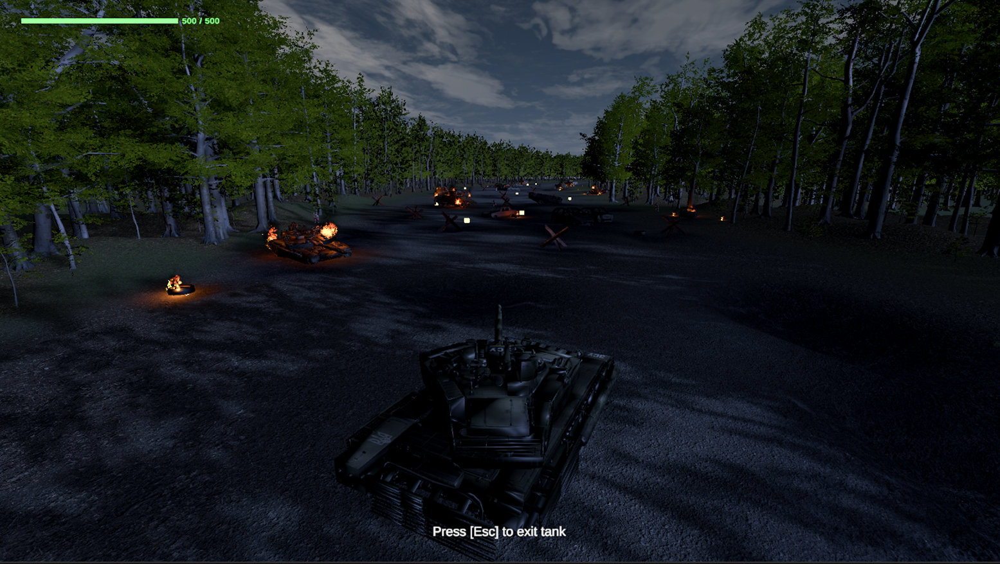
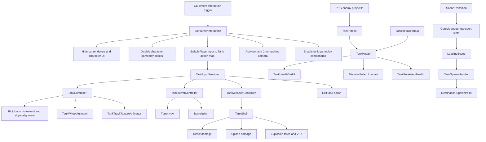
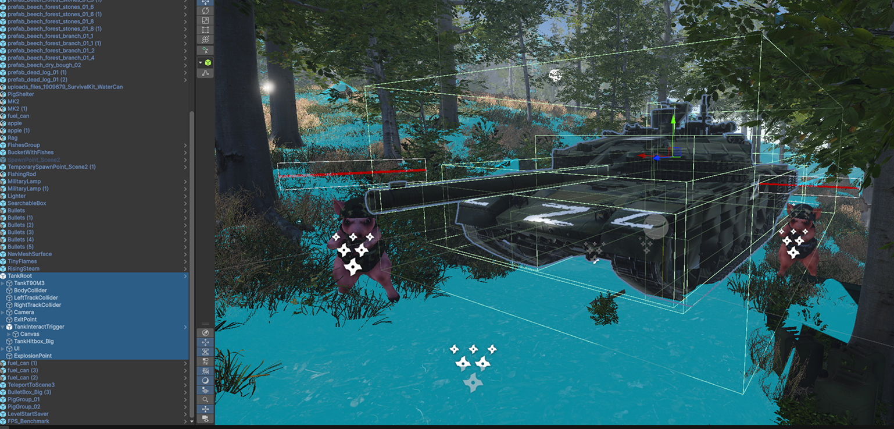
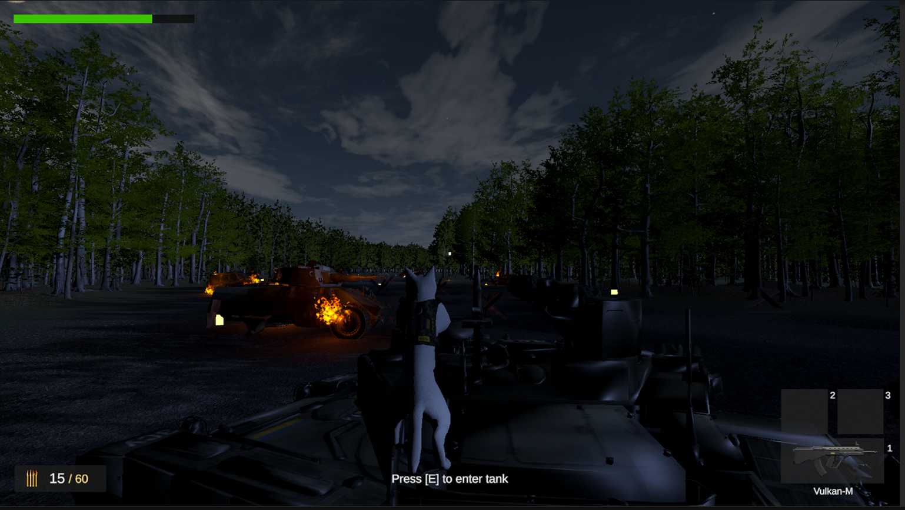
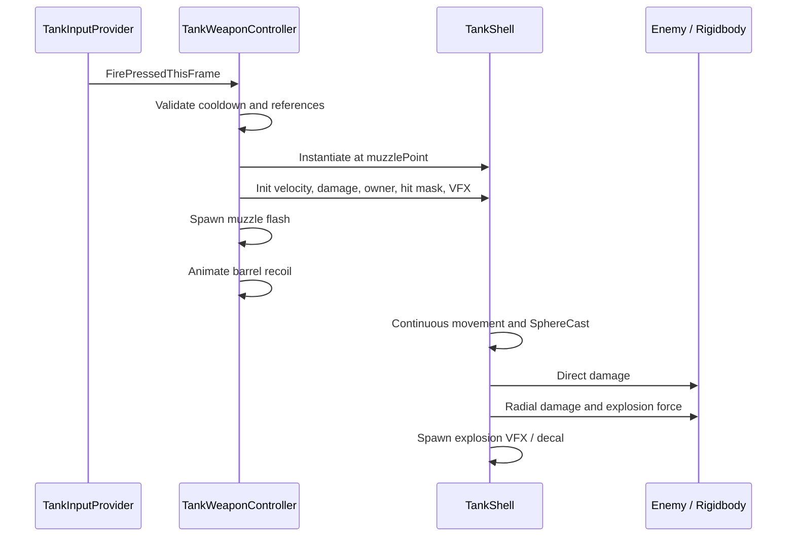
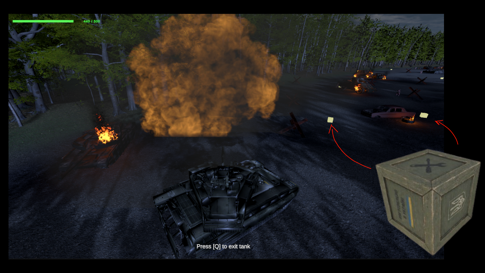

# Tank Gameplay System

The tank is the central vehicle mechanic of **ZSU HUB**. It is introduced near the end of the forest combat level and becomes the primary gameplay system in the final mission.

The implementation combines:

- runtime switching between character and vehicle control;
- Rigidbody-based vehicle movement;
- independent hull, turret, and barrel control;
- procedural road-wheel rotation and track-material scrolling;
- projectile-based cannon combat;
- direct and radial damage;
- tank health, repair, destruction, and mission-failure states;
- camera and HUD switching;
- material-based Ukrainian repainting;
- cross-scene tank transport and health persistence.

The vehicle is based on a **T-90M-style tank asset**, while its control, combat, interaction, state-management, visual-feedback, and scene-integration systems were implemented in Unity with C#.



*The player controls the tank during the final road combat sequence. The tank HUD displays its current condition while the vehicle remains independently operable from the cat character.*

---

## 1. Gameplay Role

The tank expands the project from character-based third-person combat into vehicle gameplay.

Its gameplay progression is divided into two stages:

1. **Forest level**
   - Shaiba reaches the guarded tank.
   - The player can repaint the vehicle.
   - Entering the tank replaces character control with vehicle control.
   - The tank and the player are transferred together to the next scene.

2. **Final combat level**
   - The player drives through a night-time battlefield.
   - RPG enemies select the cat or the tank as a target.
   - The tank can fire explosive shells at enemies.
   - Repair crates restore lost vehicle health.
   - Destruction of either Shaiba or the tank activates a failure state.

This makes the vehicle more than a static level prop. It participates in input routing, camera control, combat, UI, damage, saving, scene transitions, and restart recovery.

---

## 2. System Architecture



The system is intentionally separated into small components. Input, movement, aiming, shooting, damage, animation, camera switching, persistence, and interactions are not implemented inside one large vehicle script.

---

## 3. Main Components

| Component | Responsibility |
|---|---|
| `TankEnterInteraction` | Detects Shaiba, enters or exits the tank, hides/restores the character, switches cameras, UI, scripts, and input maps |
| `TankInputProvider` | Central access point for the `Tank` Input Action Map |
| `TankController` | Rigidbody movement, acceleration, reverse movement, steering, boost, ground detection, slope alignment, and parking |
| `TankTurretController` | Mouse-driven turret yaw and barrel pitch |
| `TankWheelAnimator` | Rotates left and right road wheels from actual vehicle velocity and steering input |
| `TankTrackTextureAnimator` | Scrolls left and right track textures independently |
| `TankWeaponController` | Cooldown, projectile spawning, muzzle flash, optional audio, and barrel recoil |
| `TankShell` | Fast-projectile collision detection, explosion, direct damage, splash damage, decals, and force |
| `TankHealth` | Vehicle health, repair, death state, burnt material, script disabling, and restart restoration |
| `TankHitbox` | Forwards damage from child colliders to the root health component |
| `TankHealthBarUI` | Displays tank health and changes its colour by health range |
| `TankRepairPickup` | Trigger-based repair interaction |
| `TankRepaintInteraction` | Replaces selected material slots with the Ukrainian tank material and restores the state after restart |
| `TankPersistentHealth` | Preserves vehicle health between gameplay scenes |
| `TankSpawnHandler` | Positions the transported tank at a named destination spawn point |
| `SceneTransition` / `GameManager` | Store whether the tank and the player-inside-tank state must be transferred |

---

## 4. Prefab and Collision Setup



*The tank root contains the Rigidbody, gameplay scripts, multiple body and track colliders, an entry trigger, an exit point, hitboxes, UI references, and the explosion point.*

The tank uses a compound-collider structure instead of relying on the visual mesh as one collision shape. This provides several benefits:

- the hull, tracks, and other large sections can use simplified colliders;
- child colliders can forward damage to one `TankHealth` component;
- the entry area can remain an independent trigger;
- shell collision is more reliable than with a complex concave mesh;
- physical and gameplay boundaries can be tuned without changing the rendered model.

`TankHitbox` resolves the parent health component automatically:

```csharp
private void Awake()
{
    if (tankHealth == null)
        tankHealth = GetComponentInParent<TankHealth>();
}

public void TakeDamage(float damage)
{
    if (tankHealth != null)
        tankHealth.TakeDamage(damage);
}
```

This allows projectiles to hit any configured part of the vehicle while maintaining one authoritative health value.

---

## 5. Entering and Exiting the Tank



*The tank is registered through a trigger-based interaction. The player enters it through the character `Interact` action.*

### Entry detection

`TankEnterInteraction` resolves the character root through one of three paths:

1. `PlayerInput` in a parent object;
2. `CharacterController` in a parent object;
3. traversal of the hierarchy until an object with the `Player` tag is found.

This is more robust than checking only the collider that entered the trigger because Shaiba contains multiple nested objects and colliders.

### Enter sequence

When the `Interact` action is pressed, the following sequence runs:

```text
Detect player
→ hide character renderers
→ disable character movement/combat/inventory scripts
→ hide character health, ammunition, and inventory UI
→ enable Tank input
→ enable tank control scripts
→ activate tank Cinemachine camera
→ lock the cursor
→ record playerIsInTank in GameManager
```

The character object is not destroyed. Its renderers and selected behaviours are disabled and stored in collections so that the same objects can be restored later.

### Exit sequence

When the `ExitTank` action is triggered:

```text
Disable Tank input
→ disable tank control scripts
→ move Shaiba to ExitPoint
→ zero character Rigidbody velocity
→ restore character renderers and scripts
→ restore character UI
→ reactivate the character camera
→ update GameManager state
```

The exit position is defined by an `exitPoint` Transform. When no explicit point is assigned, the fallback position is placed beside the tank.

`Physics.SyncTransforms()` is called after repositioning to ensure that the physics world receives the character's new transform immediately.

---

## 6. Input Architecture

The tank does not read individual keyboard keys inside every subsystem. `TankInputProvider` exposes one shared interface backed by Unity's Input System.

The `Tank` action map contains:

| Action | Data type | Used by |
|---|---:|---|
| `Move` | `Vector2` | Forward/reverse movement and hull steering |
| `Aim` | `Vector2` | Turret yaw and barrel pitch |
| `Boost` | Button | Increased forward speed |
| `Fire` | Button | Cannon firing |
| `ExitTank` | Button | Return to character control |

```csharp
public Vector2 Move =>
    IsActive && moveAction != null
        ? moveAction.ReadValue<Vector2>()
        : Vector2.zero;

public Vector2 Aim =>
    IsActive && aimAction != null
        ? aimAction.ReadValue<Vector2>()
        : Vector2.zero;
```

When Shaiba enters the vehicle, the existing `PlayerInput` component switches from the `Player` map to the `Tank` map. On exit, the provider disables vehicle input and returns to the character action map.

This design prevents both the cat and tank from reacting to the same input at the same time.

> Keyboard and mouse bindings remain configurable in the Input Actions asset. The C# code depends on action names rather than hard-coded movement or firing keys.

---

## 7. Rigidbody-Based Vehicle Movement

`TankController` uses a Rigidbody rather than directly changing the Transform.

Default physical configuration:

| Parameter | Value |
|---|---:|
| Rigidbody mass | `5000` |
| Linear damping | `0.5` |
| Angular damping | `5` |
| Collision detection | `Continuous Dynamic` |
| Interpolation | `Interpolate` |
| Forward speed | `7` |
| Reverse speed | `4` |
| Boost multiplier | `1.6` |
| Acceleration | `4` |
| Turn speed | `70°/s` |
| Ground check distance | `3` |
| Ground stick force | `10` |
| Slope alignment speed | `8` |

### Input separation

The vertical movement-axis value controls forward or reverse motion. The horizontal value controls hull rotation.

```csharp
tankMoveInput = input.Move.y;
tankTurnInput = input.Move.x;
```

### Movement along terrain

The forward direction is projected onto the current ground plane:

```csharp
Vector3 forward = Vector3.ProjectOnPlane(
    transform.forward,
    groundNormal
).normalized;
```

This prevents the desired velocity from continuing horizontally while the tank is driving up or down an inclined surface.

Forward and reverse movement use different speed limits:

```csharp
float targetSpeed = tankMoveInput >= 0f
    ? tankMoveInput * activeForwardSpeed
    : tankMoveInput * reverseSpeed;
```

The horizontal Rigidbody velocity is interpolated toward the target velocity instead of changing instantly. This creates heavy acceleration and deceleration without requiring WheelColliders.

### Reverse steering

Steering direction is inverted while reversing:

```csharp
float directionMultiplier =
    tankMoveInput < 0f ? -1f : 1f;
```

This makes the rear of the tank move in the expected direction when the player reverses and turns.

### Boost

Boost is applied only while the vehicle is moving forward:

```csharp
if (input.BoostHeld && tankMoveInput > 0f)
    activeForwardSpeed *= boostMultiplier;
```

The boost therefore cannot multiply reverse speed.

---

## 8. Ground Detection and Slope Alignment

A downward raycast from `groundCheckPoint` detects the surface and stores its normal.

When grounded, the desired hull rotation is aligned with that normal:

```csharp
Quaternion slopeRotation =
    Quaternion.FromToRotation(
        targetRotation * Vector3.up,
        groundNormal
    ) * targetRotation;

targetRotation = Quaternion.Slerp(
    targetRotation,
    slopeRotation,
    slopeAlignSpeed * Time.fixedDeltaTime
);
```

The Rigidbody does not freeze X or Z rotation. This is intentional: locking those axes would keep the tank perfectly upright and prevent it from following uneven terrain.

A downward acceleration is also applied along the surface normal:

```csharp
tankRb.AddForce(
    -groundNormal * groundStickForce,
    ForceMode.Acceleration
);
```

This reduces visual hovering and helps the vehicle remain attached to sloped ground.

Unwanted pitch and roll angular velocity are damped while yaw remains responsive:

```csharp
tankRb.angularVelocity = new Vector3(
    tankRb.angularVelocity.x * 0.25f,
    tankRb.angularVelocity.y,
    tankRb.angularVelocity.z * 0.25f
);
```

---

## 9. Parked State

Tank control is disabled while no player is driving it.

When inactive, the controller can place the Rigidbody into a parked state:

```csharp
tankRb.isKinematic = parked;
```

Before parking, linear and angular velocity are cleared. This prevents the unoccupied vehicle from slowly sliding, rotating, or continuing to process movement after the player exits.

When tank input becomes active, physics is restored before movement is processed.

---

## 10. Mouse-Driven Turret and Barrel

The hull and weapon orientation are independent.

- the hull rotates from `Move.x`;
- the turret rotates horizontally from `Aim.x`;
- the barrel rotates vertically from `Aim.y`.

The current implementation uses mouse-look delta from the Input System. It does not snap the cannon to one world-space target. Instead, mouse movement accumulates desired yaw and pitch values.

```csharp
Vector2 aim = input.Aim;

targetYaw += aim.x * yawSensitivity;

float pitchDirection = invertPitch ? -1f : 1f;
targetPitch +=
    aim.y *
    pitchSensitivity *
    pitchDirection;
```

### Separate pivots

The setup uses two transforms:

- `turretYawPivot` — horizontal rotation around the Y axis;
- `barrelPitchPivot` — vertical rotation around the local X axis.

This separation allows the player to aim without rotating the entire vehicle.

### Smoothing

Turret yaw uses angle-aware interpolation:

```csharp
currentYaw = Mathf.LerpAngle(
    currentYaw,
    targetYaw,
    yawSmoothSpeed * Time.deltaTime
);
```

Barrel pitch uses linear interpolation and is clamped:

```csharp
currentPitch = Mathf.Lerp(
    currentPitch,
    targetPitch,
    pitchSmoothSpeed * Time.deltaTime
);

currentPitch = Mathf.Clamp(
    currentPitch,
    minPitch,
    maxPitch
);
```

Default aiming values:

| Parameter | Value |
|---|---:|
| Yaw sensitivity | `0.08` |
| Yaw smoothing | `12` |
| Pitch sensitivity | `0.06` |
| Pitch smoothing | `12` |
| Minimum pitch | `-3°` |
| Maximum pitch | `24°` |

The original local rotations of both pivots are cached in `Awake()`, so imported model orientation is preserved.

---

## 11. Procedural Track Animation

The tracks are not animated through an Animator clip. Their visual motion is generated procedurally from:

- actual Rigidbody forward velocity;
- current steering input;
- separate left and right texture offsets.

### Forward-speed calculation

```csharp
float forwardSpeed = Vector3.Dot(
    tankRigidbody.linearVelocity,
    transform.forward
);
```

Using the dot product means that the animation reacts to the tank's true movement along its forward axis rather than only to the player's input.

### Differential track speed

```csharp
float leftTrackSpeed =
    forwardSpeed +
    turnInput * turnScrollSpeed;

float rightTrackSpeed =
    forwardSpeed -
    turnInput * turnScrollSpeed;
```

During straight movement, both tracks scroll at the same rate.

During steering:

- one track scrolls faster;
- the opposite track scrolls slower;
- depending on direction and inversion settings, the two sides can move in opposite visual directions during a tight turn.

### Material UV scrolling

The accumulated values are written to the material texture offset:

```csharp
leftOffset +=
    leftTrackSpeed *
    scrollSpeed *
    Time.deltaTime;

rightOffset +=
    rightTrackSpeed *
    scrollSpeed *
    Time.deltaTime;
```

The script supports:

- `mainTextureOffset`;
- URP Lit `_BaseMap`;
- shaders using `_MainTex`.

The left and right renderers use separate material instances, which allows each side to have an independent offset.

Default track values:

| Parameter | Value |
|---|---:|
| Scroll speed | `0.6` |
| Turning scroll speed | `2` |
| Scroll axis | Y |
| Invert left track | `false` |
| Invert right track | `true` |

This is a visual track simulation. The Rigidbody remains responsible for actual vehicle movement and collision.

---

## 12. Procedural Road-Wheel Rotation

`TankWheelAnimator` rotates arrays of left and right wheel transforms.

Like the track animation, it combines real forward velocity with steering input:

```csharp
float leftTrackSpeed =
    forwardSpeed -
    turnInput * turnWheelSpeed;

float rightTrackSpeed =
    forwardSpeed +
    turnInput * turnWheelSpeed;
```

Linear travel is converted to angular rotation using wheel circumference:

```csharp
float circumference =
    2f * Mathf.PI * wheelRadius;

float degreesPerSecond =
    speed / circumference * 360f;
```

Default values:

| Parameter | Value |
|---|---:|
| Wheel radius | `0.45` |
| Local rotation axis | `Vector3.right` |
| Rotation multiplier | `1` |
| Turning wheel speed | `4` |
| Invert left wheels | `false` |
| Invert right wheels | `true` |

The wheel and track systems remain visual-only and can be tuned independently from the movement physics.

---

## 13. Cannon Firing Pipeline

`TankWeaponController` processes firing only while `TankInputProvider.IsActive` is true.



Default weapon settings:

| Parameter | Value |
|---|---:|
| Shell speed | `95` |
| Direct damage | `120` |
| Fire cooldown | `1.2 s` |
| Shell lifetime | `6 s` |
| Spawn forward offset | `0.5` |
| Recoil distance | `0.35` |
| Recoil-back time | `0.06 s` |
| Recoil-return time | `0.25 s` |

### Safe projectile spawning

The shell is spawned slightly in front of the muzzle:

```csharp
Vector3 spawnPosition =
    muzzlePoint.position +
    muzzlePoint.forward *
    shellSpawnForwardOffset;
```

This reduces the chance of immediately colliding with the tank's own barrel or hull.

The projectile also receives its owner root and ignores owner colliders.

### Firing feedback

A shot can trigger:

- instantiated muzzle-flash Particle Systems;
- optional one-shot audio;
- a visible shell;
- barrel recoil;
- explosion VFX;
- explosion decal;
- physical impulse on nearby Rigidbodies.

---

## 14. Barrel Recoil

Recoil is implemented procedurally by moving a selected barrel transform in local space.

The transform moves backward quickly:

```csharp
recoilTransform.localPosition =
    Vector3.Lerp(start, back, t);
```

It then returns with a cubic ease-out curve:

```csharp
t = 1f - Mathf.Pow(1f - t, 3f);
```

This produces a fast mechanical kick followed by a slower, smoother recovery.

No Animator state is required, and recoil settings can be tuned directly in the Inspector.

---

## 15. Fast-Shell Collision Detection

A shell moving at high velocity can pass through a thin collider between physics steps. The implementation addresses this in two ways:

1. Rigidbody collision mode is set to `ContinuousDynamic`.
2. `TankShell` performs an additional cast between its previous and current positions.

```csharp
Vector3 movement =
    currentPosition - lastPosition;

RaycastHit[] hits = Physics.SphereCastAll(
    lastPosition,
    collisionRadius,
    movement.normalized,
    movement.magnitude,
    hitMask,
    QueryTriggerInteraction.Collide
);
```

Hits are sorted by distance, and the nearest valid target is processed first.

`OnCollisionEnter` and `OnTriggerEnter` remain as fallback paths, so the projectile works with both ordinary colliders and trigger-based hitboxes.

---

## 16. Direct Damage, Splash Damage, and Force

On impact, `TankShell` performs several separate operations:

1. direct damage to the hit enemy or hitbox;
2. radial search through `Physics.OverlapSphere`;
3. distance-based splash damage;
4. explosion force on nearby Rigidbodies;
5. VFX, sound, and surface mark.

The configured explosion radius is `6`, and the default explosion force is `2500`.

A `HashSet` prevents one enemy with several child colliders from receiving the same splash damage repeatedly. A second set prevents one Rigidbody from receiving duplicate explosion forces.

The directly hit enemy is registered before the radial pass so that it does not also receive a second full splash-damage application.

---

## 17. Receiving RPG Damage

RPG enemies can target either:

- Shaiba while the character is outside the tank;
- the tank while the player is driving it.

The RPG projectile checks for `TankHitbox` first and falls back to `TankHealth`.

Its radial damage pass stores one damage value per `TankHealth` object, preventing a compound tank prefab with several colliders from multiplying splash damage.

```text
RPG collision
→ TankHitbox or TankHealth
→ direct damage
→ radial overlap
→ maximum splash value per tank
→ TankHealth.TakeDamage()
→ health event and UI update
```

This keeps damage consistent regardless of how many child colliders overlap the explosion.

---

## 18. Health and Destruction

The tank starts with a maximum health value of `500`.

`TankHealth` exposes:

- `TakeDamage(float damage)`;
- `Heal(float amount)`;
- `RepairFull()`;
- `OnHealthChanged`;
- `OnTankDestroyed`;
- `CurrentHealth`;
- `MaxHealth`;
- `IsDead`.

Health is clamped to the valid range after every change.

### Death sequence

When health reaches zero:

```text
Mark tank as dead
→ update the HUD to zero
→ spawn destruction effect
→ apply burnt material
→ disable configured gameplay scripts
→ stop the Rigidbody
→ optionally make it kinematic
→ invoke OnTankDestroyed
→ display Mission Failed
→ restart through the loading pipeline
```

The vehicle is not required to be immediately deleted. This allows the destroyed tank to remain visible as a burnt battlefield object while the failure screen is shown.

### Restart restoration

`TankHealth` implements `ILevelResettable`.

At the saved start of a level, it records the tank's health. During restart it restores:

- the saved health value;
- original Rigidbody configuration;
- original materials;
- scripts disabled by the death sequence;
- the health UI event state.

This is more reliable than only reloading the scene because some vehicle state is also stored in persistent objects.

---

## 19. Tank Health UI

The tank HUD is event-driven.

`TankHealthBarUI` subscribes to `TankHealth.OnHealthChanged` and updates:

- fill amount;
- numeric health text;
- colour.

Health ranges:

| Health percentage | Colour state |
|---:|---|
| Above 70% | Full / green |
| 45–70% | Medium / yellow |
| 20–45% | Low / orange |
| 0–20% | Critical / red |

The current version can hide the tank HUD when `TankInputProvider.IsActive` is false. Therefore, the vehicle UI is shown while the player controls the tank and does not remain over the character interface after exiting.

---

## 20. Repair Crates



*Repair crates are placed between battlefield obstacles and highlighted to remain visible in the dark final level.*

`TankRepairPickup` detects a `TankHealth` component when the vehicle enters its trigger.

The default repair interaction:

- displays `Press [E] to use Repair Item`;
- repairs `150` health;
- can optionally perform a full repair;
- immediately hides the crate model and its colliders;
- optionally spawns a pickup effect;
- displays `Repair successful`;
- destroys the consumed object after the message delay.

```csharp
if (fullRepair)
    currentTankHealth.RepairFull();
else
    currentTankHealth.Heal(repairAmount);
```

The success-message delay uses realtime waiting, so it can complete even when normal gameplay time is paused.

---

## 21. Ukrainian Repaint Interaction


*The original vehicle material can be replaced with a Ukrainian-themed variant before the tank is used in the final mission.*

`TankRepaintInteraction` detects Shaiba inside a repaint trigger and replaces selected material slots.

Each paint target stores:

```csharp
public Renderer renderer;
public int materialIndex;
```

This is safer than replacing every material on the tank because track, glass, metal, or detail materials can remain unchanged.

### Repaint persistence

The repaint state can survive:

- entry into the tank;
- the transition from the forest level to the final level;
- death and restart;
- reloading through `LoadingScene`.

The system uses:

- a static session flag;
- an optional `PlayerPrefs` key;
- scene-loaded callbacks;
- `ILevelResettable`;
- repeated short reapplication after loading.

The repeated restore routine protects against another component applying its default material later in `Start()`.

The interaction is locked after successful repainting, preventing repeated material replacement.

---

## 22. Camera and HUD Switching

The tank has its own Cinemachine camera object.

`TankEnterInteraction` switches cameras by activating the vehicle camera and deactivating the character camera:

```csharp
tankCinemachineCamera.SetActive(true);
catCinemachineCamera.SetActive(false);
```

On exit, the state is reversed.

At the same time:

- character health, ammunition, and inventory UI are hidden;
- the tank health HUD becomes active;
- the cursor is locked and hidden;
- only tank scripts receive input.

The camera transition is therefore part of the same atomic mode switch as input and UI, reducing the chance of mixed character/vehicle states.

---

## 23. Cross-Scene Tank Transport

The tank is acquired in the second gameplay level and transported into the third.

`SceneTransition` determines whether the trigger was activated by the character or by the vehicle. For a tank transition it stores:

```text
targetScene
targetSpawnID
transportTank = true
playerIsInTank = true
```

The transition then loads `LoadingScene`.

After the destination scene has loaded, `TankSpawnHandler`:

1. waits for one rendered frame;
2. waits for one physics step;
3. searches for `SpawnPoint` objects;
4. matches `spawnID` with `GameManager.targetSpawnID`;
5. clears Rigidbody velocity;
6. assigns position and rotation;
7. reports tank-spawn completion to `GameManager`.

```csharp
rb.linearVelocity = Vector3.zero;
rb.angularVelocity = Vector3.zero;
rb.position = spawnPos;
rb.rotation = spawnRot;
```

Waiting before placement allows scene objects and physics components to finish initialization.

---

## 24. Player-In-Tank Restoration

The destination tank checks `GameManager.playerIsInTank` after spawning.

When this state is true, `TankEnterInteraction` automatically:

- finds the newly spawned character;
- waits until the player spawn has completed;
- hides the character again;
- enables the tank action map;
- activates the tank camera;
- restores the driving state without requiring another interaction.

This keeps the transition visually continuous even though both gameplay scenes contain their own scene-local objects.

---

## 25. Persistent Tank Health

`TankPersistentHealth` is a singleton with `DontDestroyOnLoad`.

Its default and saved health values are both `500`.

It provides:

```csharp
SaveHealth(float health)
LoadHealth()
ResetHealth()
```

This object survives gameplay-scene changes and is destroyed when the main menu is loaded, preventing one playthrough's damaged tank from leaking into a new game.

The system separates:

- **scene persistence** — health between the forest and final levels;
- **restart state** — health restored to the saved start of the current level.

---

## 26. Failure and Restart Integration

Tank destruction is treated as a level-failure condition.

`LevelRestartOnDeath` subscribes to both character and tank death events. On tank destruction it can:

1. show the mission-failure screen;
2. hold the screen for a configured duration;
3. fade to black;
4. ask `GameManager` to restore the saved level-start state;
5. reload through `LoadingScene`;
6. respawn the tank and player at the correct point.

The restart pipeline also restores objects implementing `ILevelResettable`, including tank health and repaint state.

---

## 27. Visual Animation Strategy

The tank does not depend on one large Animator Controller.

Most vehicle feedback is procedural:

| Visual element | Implementation |
|---|---|
| Hull movement | Rigidbody velocity and rotation |
| Terrain tilt | Ground-normal alignment |
| Turret rotation | Mouse `Aim.x` accumulated into yaw |
| Barrel elevation | Mouse `Aim.y` accumulated into clamped pitch |
| Track motion | Independent material UV offsets |
| Road-wheel motion | Procedural Transform rotation |
| Cannon recoil | Coroutine-based local-position animation |
| Muzzle flash | Runtime Particle System instance |
| Explosion | Runtime VFX prefab |
| Destruction appearance | Runtime material replacement |

This makes each effect independently configurable and keeps the vehicle logic readable.

---

## 28. Performance and Reliability Decisions

### Physics and rendering separation

- movement and rotation are processed in physics updates;
- wheel and track visuals are updated independently;
- visual animation does not drive the Rigidbody.

### Continuous projectile collision

`ContinuousDynamic` and a frame-to-frame SphereCast reduce high-speed tunnelling.

### Compound damage de-duplication

Collections keyed by health component or Rigidbody prevent several child colliders from multiplying one explosion.

### Kinematic parking

The idle tank does not continue simulating unnecessary movement when nobody controls it.

### Event-driven health UI

The bar updates when health changes instead of recalculating health values every frame.

### Independent track materials

Per-renderer material instances permit different offsets for the left and right tracks without duplicating the entire vehicle model.

### Scene-spawn synchronization

The loading flow waits for both player and optional tank spawning before completing, reducing race conditions between camera, input, UI, and vehicle placement.

---

## 29. Key Inspector Defaults

| System | Parameter | Default |
|---|---|---:|
| `TankController` | Forward speed | `7` |
|  | Reverse speed | `4` |
|  | Boost multiplier | `1.6` |
|  | Acceleration | `4` |
|  | Turn speed | `70` |
|  | Rigidbody mass | `5000` |
| `TankTurretController` | Yaw sensitivity | `0.08` |
|  | Pitch sensitivity | `0.06` |
|  | Pitch range | `-3° to 24°` |
| `TankWheelAnimator` | Wheel radius | `0.45` |
|  | Turn wheel speed | `4` |
| `TankTrackTextureAnimator` | Scroll speed | `0.6` |
|  | Turn scroll speed | `2` |
| `TankWeaponController` | Shell speed | `95` |
|  | Direct damage | `120` |
|  | Cooldown | `1.2 s` |
|  | Recoil distance | `0.35` |
| `TankShell` | Explosion radius | `6` |
|  | Explosion force | `2500` |
| `TankHealth` | Maximum health | `500` |
| `TankRepairPickup` | Repair amount | `150` |
| `TankRepaintInteraction` | Repaint key | `Q` |
| `TankPersistentHealth` | Default saved health | `500` |

---

## 30. Validation Checklist

The system was tested through the following gameplay paths:

- Shaiba enters the tank from different child colliders;
- character controls stop after entry;
- tank controls do not work before entry;
- camera and HUD switch correctly;
- the tank accelerates, reverses, steers, and boosts;
- reverse steering behaves correctly;
- the hull follows sloped ground;
- left and right tracks animate independently;
- road wheels match forward and turning motion;
- the turret rotates independently from the hull;
- barrel pitch remains within configured limits;
- cannon cooldown blocks rapid repeated firing;
- shells do not collide with the firing tank;
- high-speed shells register impacts;
- one enemy does not receive repeated splash damage from several colliders;
- RPG direct and splash damage update tank health;
- the health bar changes fill, text, and colour;
- repair crates restore health once and disappear;
- repaint affects only selected material slots;
- repaint survives scene transition and restart;
- tank health transfers between scenes;
- the tank appears at the named destination spawn point;
- the player remains inside after a vehicle transition;
- exiting restores Shaiba, the character camera, UI, and input;
- tank destruction activates mission failure;
- restart restores physics, materials, scripts, health, and spawn state.

---

## 31. Summary

The tank system is a connected gameplay subsystem rather than an isolated controller.

It combines:

- mode-based input switching;
- character-to-vehicle transitions;
- Rigidbody vehicle physics;
- independent mouse-controlled aiming;
- procedural tracks, wheels, and recoil;
- projectile and explosion simulation;
- compound hitbox handling;
- health, repair, destruction, and failure states;
- camera and interface management;
- custom repaint persistence;
- cross-scene transport and restart restoration.

The result is a reusable vehicle architecture that supports the final gameplay stage of **ZSU HUB** while remaining integrated with the project's broader scene-management, combat, UI, saving, and restart systems.

