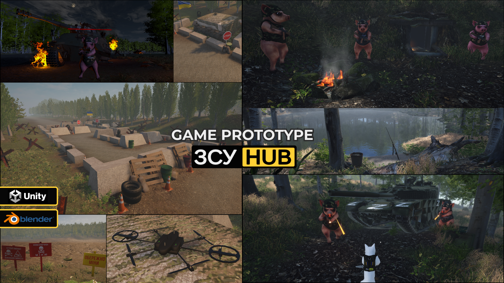
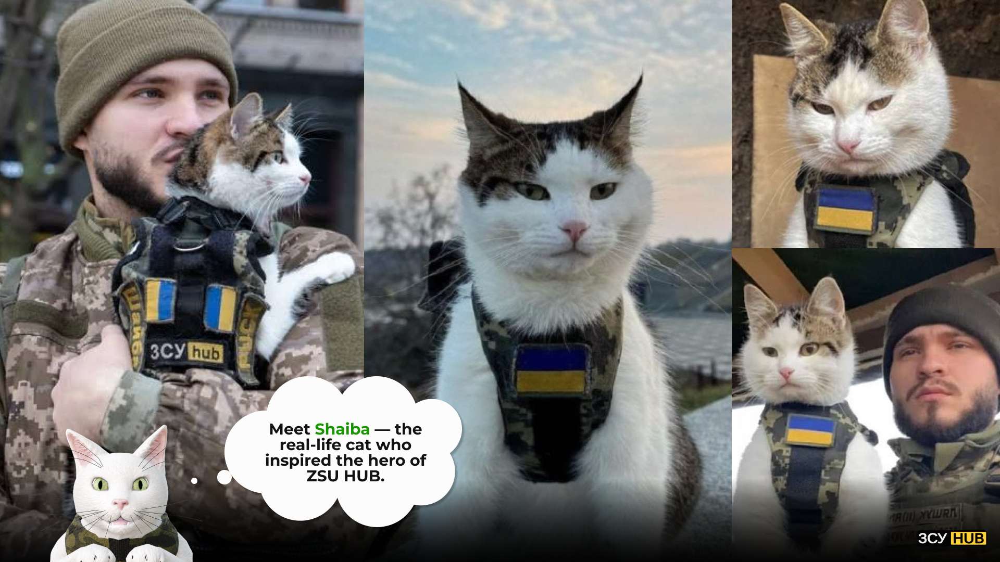
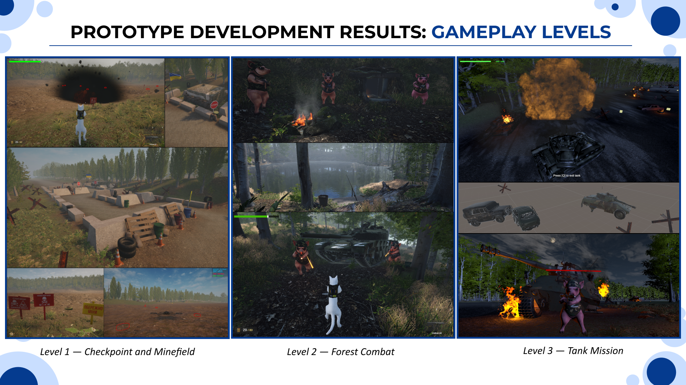
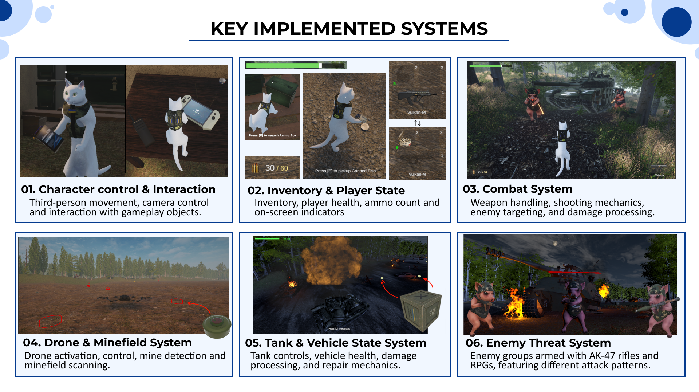
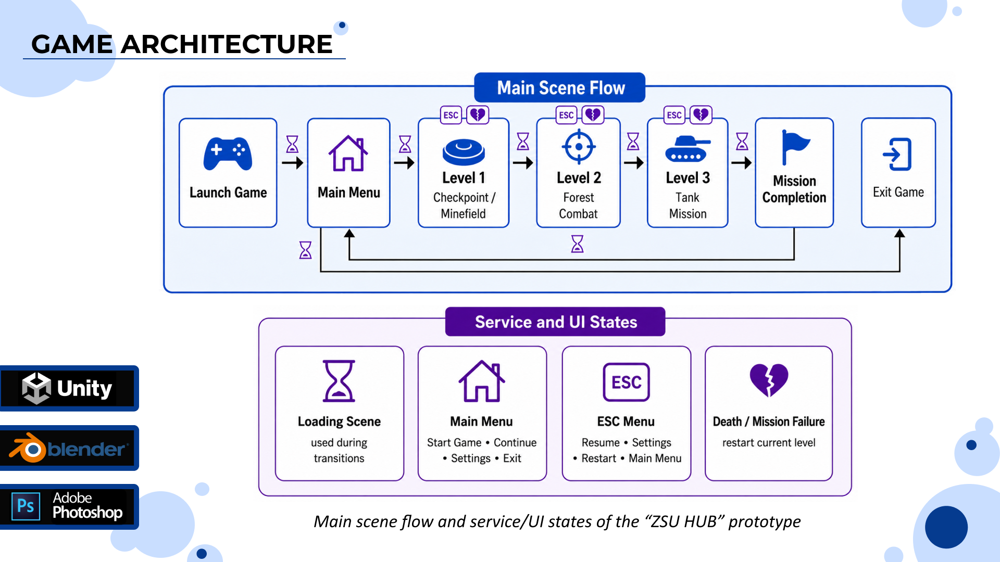
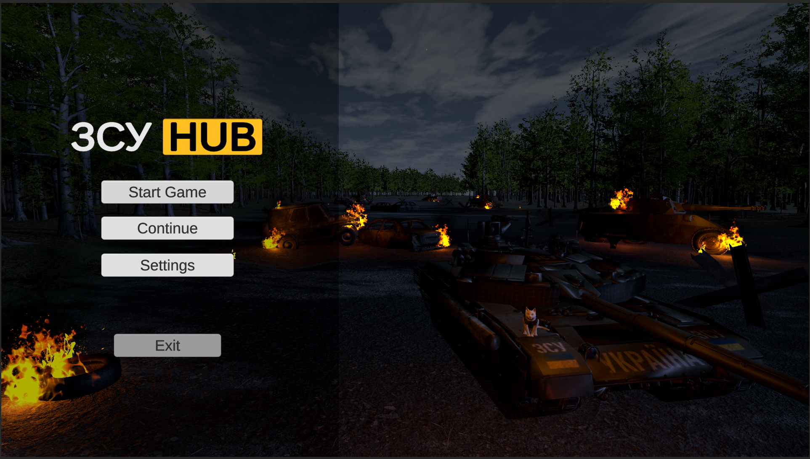
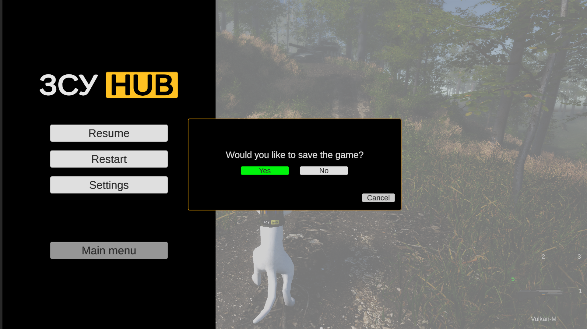

# ZSU HUB

  

  <strong>
    A multi-level third-person 3D-game prototype featuring a cat protagonist, drone-assisted mine detection, enemy combat, and tank gameplay.
  </strong>

  <a href="https://drive.google.com/file/d/1_dromuuYj7iwP7q2dJrvS_o2SimsWA1q/view?usp=drive_link"><strong>Short Gameplay Video</strong></a>
  ·
  <a href="https://drive.google.com/file/d/1IebJtHD5IYEwX-Dob3-MZhcYTNypceP3/view?usp=drive_linkhttps://drive.google.com/file/d/1IebJtHD5IYEwX-Dob3-MZhcYTNypceP3/view?usp=drive_link"><strong>Longer Gameplay Video</strong></a>
  ·
  <a href="https://www.artstation.com/marharyta-matiushchenko"><strong>ArtStation</strong></a>
  ·
  <a href="https://www.linkedin.com/in/marharyta-matiushchenko"><strong>LinkedIn</strong></a>

---

## Overview

**ZSU HUB** is a playable third-person 3D game prototype developed as my bachelor’s thesis project.

The game follows **Shaiba**, a cat protagonist travelling through three interconnected levels. The gameplay evolves from exploration and drone-assisted mine detection to direct combat and tank-based action.

Shaiba moves on four legs during exploration and transitions into a bipedal combat stance when using weapons or inventory items.

> This public repository is a portfolio showcase containing selected media, technical documentation, and original C# code samples. The complete Unity project and third-party assets are not publicly distributed.

---

## Inspiration

ZSU HUB was inspired by **Shaiba**, a real Ukrainian cat who accompanied his owner, Ukrainian soldier **Oleksandr Liashuk**, while he was on duty.

The in-game protagonist is an original stylized interpretation created specifically for the project.

  

---

## Gameplay Progression

The prototype presents one continuous journey across three connected gameplay levels.

  

### Level 1 — Checkpoint and Minefield

Exploration, item collection, drone activation, mine detection, and safe navigation through a hidden minefield.

### Level 2 — Forest Combat

Weapon-based combat, inventory management, health and ammunition systems, and encounters with groups of armed enemies.

### Level 3 — Tank Mission

Tank control, vehicle combat, RPG attacks, vehicle damage, repair supplies, and switching between character and vehicle gameplay.

---

## Project Highlights

- Third-person cat character controller
- Quadrupedal exploration and bipedal combat states
- Inventory, health, ammunition, and item systems
- Drone control and mine detection
- Weapon handling and damage processing
- Enemy navigation and combat AI
- Tank entry, control, damage, and repair
- Save slots and runtime state transfer
- Multi-scene progression
- Loading, restart, and mission-failure states
- Original character models, rigs, materials, and animations

  

---

## Technical Documentation

Detailed explanations of the project’s main systems are available on separate documentation pages:

- [Main Character — Shaiba](Documentation/Shaiba.md)
- [Drone and Minefield System](Documentation/Drone-System.md)
- [Enemy AI and Combat](Documentation/Enemy-AI.md)
- [Tank and Vehicle System](Documentation/Tank-System.md)
- [UI, Saving and Game States](Documentation/UI-and-Game-States.md)
- [Scene Management and Level Transitions](Documentation/Scene-Management.md)

---

## Game Architecture

The project uses a multi-scene structure consisting of a main menu, loading scene, and three gameplay levels.

A central game-management system coordinates scene transitions, save data, player state, inventory data, tank transportation, persistent vehicle health, and level restart behaviour.

  

<table>
  <tr>
    <td width="50%">
      
      
<strong>Main Menu</strong>

    </td>
    <td width="50%">
      
      
<strong>Pause Menu and Save Confirmation</strong>

    </td>
  </tr>
</table>
---

### Selected Code Samples

Only selected original C# scripts are included in this public repository. Each sample demonstrates one of the project’s core gameplay or architectural systems.

| Area | Code Sample | What It Demonstrates |
|---|---|---|
| Core architecture | [`GameManager.cs`](CodeSamples/Architecture/GameManager.cs) | Scene transitions, save data, runtime state persistence, level restart logic, and tank transportation |
| Player control | [`MovementStateManager.cs`](CodeSamples/Player/MovementStateManager.cs) | Camera-relative movement, jumping, slope handling, animation states, and combat-mode integration |
| Inventory and combat | [`InventoryManager.cs`](CodeSamples/Player/InventoryManager.cs) | Inventory slots, equipped items, ammunition, UI state, and save-data integration |
| Drone gameplay | [`DroneController.cs`](CodeSamples/Drone/DroneController.cs) | Drone movement, input handling, ground scanning, and mine detection |
| Enemy AI | [`RPGPigAI.cs`](CodeSamples/EnemyAI/RPGPigAI.cs) | Navigation, target selection, attack-distance management, RPG attacks, and retreat behaviour |
| Vehicle system | [`TankEnterInteraction.cs`](CodeSamples/Vehicle/TankEnterInteraction.cs) | Tank entry and exit, camera switching, input-map changes, UI switching, and player-state control |

---

## My Role

I independently worked on:

- game concept and gameplay design;
- level design and scene assembly;
- C# gameplay programming;
- character movement and combat systems;
- inventory, health, ammunition, and save systems;
- drone and mine-detection mechanics;
- enemy AI and combat interactions;
- tank controls, damage, and repair;
- menus, UI, and scene transitions;
- 3D modelling, retopology, rigging, and animation;
- materials, textures, lighting, and visual effects;
- testing, debugging, and optimization.

---

## Software used:

- **Unity**
- **C#**
- **Blender**
- **Adobe Photoshop**
- **Figma**

---

## Links

- **Gameplay Video:** [Watch the gameplay]([https://youtu.be/GrSy26wlECw](https://drive.google.com/file/d/1_dromuuYj7iwP7q2dJrvS_o2SimsWA1q/view?usp=drive_link)
- **ArtStation:** [View the full project](https://www.artstation.com/marharyta-matiushchenko)
- **LinkedIn:** [View my profile](https://www.linkedin.com/in/marharyta-matiushchenko)

---
